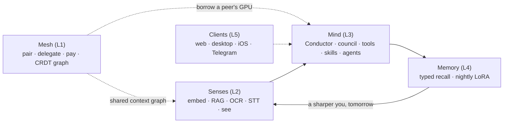
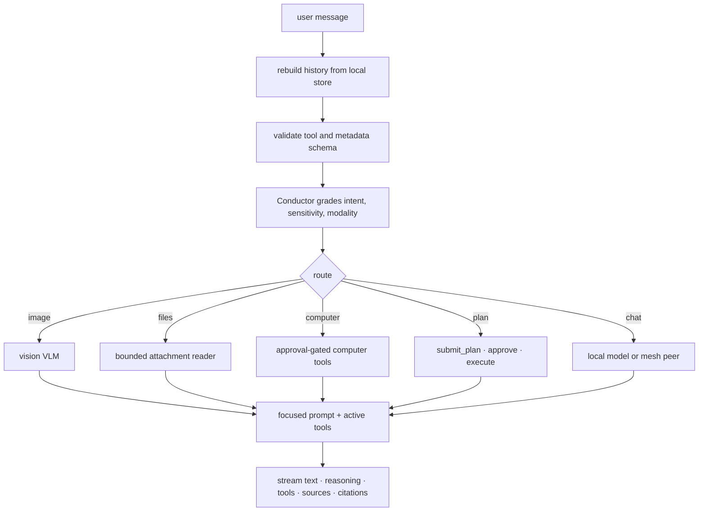

# Mycelium · Leash

**Leash** is the harness for a private, offline, end-to-end-encrypted personal AI that lives on your own devices, not in a cloud API. It perceives your world through notes, files, voice, photos/screenshots, recent screen activity, feeds, chats, tools, and memory. It reasons above the weight class of one device by routing work across your local models, skills, specialist agents, and encrypted device mesh.

**Mycelium** is the connected five-layer runtime underneath Leash: mesh, senses, mind, memory, and clients. Leash is the product surface. Mycelium is the organism.

> Built end-to-end on [`@qvac/sdk`](https://www.npmjs.com/package/@qvac/sdk) for
> **QVAC Hackathon I — "Unleash Edge AI"**. Every inference, embedding, RAG, vision,
> speech, delegation, and LoRA path goes through QVAC on local hardware. No cloud AI is
> in the loop. License: **Apache-2.0**.

- Website: <https://www.useleash.xyz/>
- Docs: <https://docs.useleash.xyz/>
- Repo license: [`Apache-2.0`](LICENSE)
- Primary track: **General Purpose** retail devices, ≤32 GB RAM

**Status (2026-06-21):** spike gate passed; all five product layers are implemented with
real QVAC-backed code; the runtime has been exercised across Mac mini, MacBook Pro, a
third Mac, and iOS. The repo now includes a structured evidence bundle under
[`evidence/`](evidence/) with per-device summaries for **mac-mini** and **mbp**.

No stubs, no mocks, no fake behavior: packages and apps exist only where the real
implementation landed.

## Submission fast path

| Requirement                      | Where to verify                                                                                                                                                                                                                                                                                |
| -------------------------------- | ---------------------------------------------------------------------------------------------------------------------------------------------------------------------------------------------------------------------------------------------------------------------------------------------- |
| QVAC-only AI, no cloud LLM calls | [`docs/hackathon/qvac-only-proof.mdx`](docs/hackathon/qvac-only-proof.mdx), [`docs/hackathon/network-disclosure.mdx`](docs/hackathon/network-disclosure.mdx), [`evidence/remote-api-calls.json`](evidence/remote-api-calls.json)                                                               |
| Apache-2.0 open source           | [`LICENSE`](LICENSE), tracked `package.json` files                                                                                                                                                                                                                                             |
| General Purpose hardware fit     | [`docs/hackathon/overview.mdx`](docs/hackathon/overview.mdx), [`docs/hackathon/evidence-and-reproducibility.mdx`](docs/hackathon/evidence-and-reproducibility.mdx)                                                                                                                             |
| Reproducible local run           | [Quickstart](#quickstart), [Reproduce the proofs](#reproduce-the-proofs), [`docs/quickstart.mdx`](docs/quickstart.mdx)                                                                                                                                                                         |
| Structured audit/evidence bundle | [`evidence/manifest.json`](evidence/manifest.json), [`evidence/qvac/mac-mini/summary.json`](evidence/qvac/mac-mini/summary.json), [`evidence/hypha/mac-mini/summary.json`](evidence/hypha/mac-mini/summary.json), [`docs/reference/audit-log.mdx`](docs/reference/audit-log.mdx)               |
| Chats and runtime evidence       | [`evidence/chats/mac-mini/index.json`](evidence/chats/mac-mini/index.json), [`evidence/chats/mbp/index.json`](evidence/chats/mbp/index.json), [`evidence/data/mac-mini/summary.json`](evidence/data/mac-mini/summary.json), [`evidence/data/mbp/summary.json`](evidence/data/mbp/summary.json) |
| Demo link                        | [YouTube demo playlist](https://www.youtube.com/playlist?list=PLeERy8YL4mpQwT3OwpzOqjp23FlrLQ_1Y)                                                                                                                                                                                              |
| Criteria map                     | [`docs/hackathon/how-we-meet-the-criteria.mdx`](docs/hackathon/how-we-meet-the-criteria.mdx)                                                                                                                                                                                                   |
| Honest limitations               | [`docs/hackathon/known-issues.mdx`](docs/hackathon/known-issues.mdx)                                                                                                                                                                                                                           |

## Table of contents

- [The idea](#the-idea)
- [The five layers](#the-five-layers)
- [Hackathon fit](#hackathon-fit)
- [What is real now](#what-is-real-now)
- [How it works](#how-it-works)
- [Structured evidence](#structured-evidence)
- [Repo layout](#repo-layout)
- [Quickstart](#quickstart)
- [Reproduce the proofs](#reproduce-the-proofs)
- [Security and privacy](#security-and-privacy)
- [Honest limitations](#honest-limitations)
- [Hard rules](#hard-rules)
- [Documentation](#documentation)

## The idea

One private intelligence distributed across your devices, in a closed loop:



Privacy is not a constraint here. It is the unlock. Because the context stays on hardware
you own, Leash can hold your total working context, make private material useful, borrow
capacity from stronger peers, and improve itself through a local memory-evolution loop.

The loop is:

1. **Perceive** local context from notes, files, chats, activity, screenshots, photos, voice, and feeds.
2. **Reason** through a QVAC-backed agent runtime with tools, skills, sub-agents, and citations.
3. **Route** work locally or across an encrypted mesh when another trusted device fits better.
4. **Remember** through typed memory, retrieval stores, and curated training data.
5. **Grow** through on-device LoRA and adapter sharing.

## The five layers

| Layer           | Role                                                                                                   | Where it lives                                     | Status |
| --------------- | ------------------------------------------------------------------------------------------------------ | -------------------------------------------------- | ------ |
| 1 — **Mesh**    | encrypted P2P pairing, delegated/split compute, paid metered settlement, replicated CRDT context graph | `packages/mesh`, `apps/hypha`                      | live   |
| 2 — **Senses**  | embeddings, RAG, OCR, STT, screen/photo sensing, context graph nodes                                   | `packages/senses`, `apps/leash-watch`              | live   |
| 3 — **Mind**    | Conductor routing, proposer/critic council, cited answers, tools, skills, sub-agents                   | `packages/mind`, `packages/leash-core`, `apps/web` | live   |
| 4 — **Memory**  | typed memory, recall, nightly QVAC Fabric LoRA, eval, adapter publish/fetch                            | `packages/memory`                                  | live   |
| 5 — **Clients** | web dashboard, Electron desktop, iOS/Android client, Telegram bridge, background daemons               | `apps/*`                                           | live   |

Each layer became a workspace only when the real implementation landed. The repo does not
carry placeholder packages to imply progress.

## Hackathon fit

### General Purpose

Leash targets the **General Purpose** track: retail devices with ≤32 GB RAM. The primary
build device is an Apple-Silicon Mac mini, with Mac peers used for private-mesh delegation
and paid-provider tests.

The track asks for the exact surface Leash exercises:

- multi-agent orchestration
- local multimodal work
- advanced RAG over private data
- P2P delegated inference
- local fine-tuning/LoRA
- privacy-first tooling
- reproducible logs and performance evidence

### Psy Models

The same build also includes a Psy-Models path. Leash serves a dedicated QVAC health
specialist alias and routes health intent to it with health-record RAG, citations, verifier
checks, and an explicit clinician disclaimer. It is a first-class capability inside the
General Purpose system, not a separate demo.

See [`docs/hackathon/overview.mdx`](docs/hackathon/overview.mdx),
[`docs/hackathon/medpsy-workflow.mdx`](docs/hackathon/medpsy-workflow.mdx), and
[`docs/hackathon/how-we-meet-the-criteria.mdx`](docs/hackathon/how-we-meet-the-criteria.mdx).

## What is real now

Every item below is implemented as QVAC-backed code and backed by committed logs, smoke
scripts, structured JSON, or local-fork settlement evidence.

- **Private grounded chat.** The chat surface answers from local notes, files, memories,
  activity, attachments, and prior chats. It streams reasoning, tool results, source chips,
  citations, conductor events, and approval cards.
- **On-device inference, embeddings, and RAG.** The spike gate proved local streaming,
  embeddings, cited retrieval, and no-context refusal behavior. Runtime paths use the same
  `@qvac/sdk` serve boundary. Representative spike numbers: Llama-3.2-1B warm TTFT
  **56 ms / 70.6 tok/s**; RAG retrieval **23 ms** with top score **0.768**.
- **Chats as evidence.** The structured bundle includes chat indexes for Mac mini and MacBook
  Pro, with message counts, date windows, and hashes. Start at
  [`evidence/chats/mac-mini/index.json`](evidence/chats/mac-mini/index.json) and
  [`evidence/chats/mbp/index.json`](evidence/chats/mbp/index.json).
- **Vision, voice, and image generation.** Image turns route to the VLM; speech uses local
  STT/TTS aliases; image generation is wired through local model capability routes.
- **Encrypted P2P delegated compute.** A weak device can hand a heavy turn to a stronger peer
  over an encrypted Hyperswarm path. Hypha exposes local health, peers, OpenAI-shaped shim
  routes, provider firewalling, and delegation logs. The spike measured **1.27 s** round trip,
  **257 ms** TTFT, and **45.4 tok/s** on the provider; live two-Mac delegated completion was
  measured at **317 ms** TTFT and **100.7 tok/s**.
- **A machine economy path.** Private-mesh delegation is free. Public/paid routes can meter
  delegated work and settle on a local `anvil` fork through x402/Permit2-style receipts for
  reproducible proof without touching a live public chain. The proof path settled a 286-token
  delegated completion and uses per-session highest-rung settlement so gas is O(1) per session.
- **Conductor routing.** The Conductor decides local vs peer using intent, modality,
  sensitivity, capability, cost, and live capacity. Its privacy gate is non-overridable:
  private prompts never route to public mesh providers.
- **Agent system.** Leash runs as the default agent, with markdown-defined specialist
  sub-agents, Claude-compatible skill/plugin concepts, deterministic skill pipelines, MCP
  tool groups, and explicit approval gates.
- **Proactivity.** The heartbeat loop reads the local constitution, recent activity, memory,
  and scheduled jobs, then writes bounded notifications and tasks through local tools.
- **Ambient sensing.** The watcher can summarize screen activity locally with the VLM and
  delete raw frames immediately after extraction.
- **Understory.** The newsroom daemon discovers leads, stages a private brief, researches,
  drafts, checks claims, generates art, and publishes editions locally.
- **File attachments.** Image attachments route to the vision model; text, code, markdown,
  CSV, JSON, and logs are bounded into the chat turn as local context.
- **Nightly memory evolution.** The memory layer curates training pairs from chats, notes,
  and memories; trains/evals a personal LoRA on-device; and can publish adapters over the mesh.
  The spike produced a roughly **20 MB** adapter in **152.7 s** with **0.85** validation accuracy.
- **Clients.** Web, desktop, mobile, Telegram, and headless daemons share the same runtime
  instead of faking separate surfaces.

## How it works

### A chat turn, end to end

The web app (`apps/web/app/api/leash/chat/route.ts`) is an AI SDK `streamText` loop over
a local QVAC-compatible provider. The transport sends the current user turn and trigger;
the server rebuilds usable history from local stores and then routes the turn.



Two design choices matter on constrained hardware:

- **Focused toolsets.** The model is not offered every possible tool on every turn. A computer
  turn gets computer tools, a skill turn gets that skill's declared tools, and ordinary chat
  stays lean.
- **Dynamic effort.** Turns are graded into quick, standard, or deep. That adjusts token budget,
  step cap, reasoning style, and whether to use faster `/no_think` paths.

### The Conductor

The Conductor is the routing layer in `packages/leash-core/routing` and
`apps/web/lib/leash/conductor.ts`. For a general turn it decides where the work runs:

1. Fast-path trivial local turns without invoking a classifier.
2. Grade non-trivial turns into modality, difficulty, sensitivity, and specialist hints.
3. Filter routes by capability and model class.
4. Rank local and peer options by privacy, cost, inflight load, and tier.

Specialist routes such as vision, files, and computer-use stay dedicated. General chat can
run locally or through Hypha on a paired peer. Privacy filtering happens before cost ranking.

### Agents

Leash itself is the default agent. Specialist agents are markdown files with frontmatter
describing name, description, tools, model, skills, maximum turns, MCP servers, and reserved
fields for forward compatibility. Enabled agents become callable tools for the parent model.

Sub-agents run isolated loops with restricted tools. They stream progress to the UI, but their
transcripts are summarized before returning to the parent so context stays bounded.

### Skills

Skills live as `SKILL.md` bundles with optional `references/`, `scripts/`, and `assets/`.
They can be loaded explicitly or matched from natural language. A skill can run as:

- an instruction bundle with a focused toolset
- a deterministic step pipeline
- a script-backed capability with approval gates
- a sub-task invoked through `run_skill`

Imported skills and plugins land disabled until reviewed.

### Tools and MCP groups

`apps/leash-tools-mcp` hosts capability groups as MCP servers: memory, tasks, context,
photos, image, research, skills, computer, files, scheduler, router, MCP admin, and related
local tools. Each group can be toggled. Tools that touch local files, shell, computer control,
or external services require explicit approval.

### Mesh

`apps/hypha` is the headless mesh daemon. It joins the encrypted mesh, serves delegated
inference to paired peers, exposes an OpenAI-shaped local shim, tracks peer capabilities,
replicates context graph state, and records delegation/economy evidence.

The mesh uses private device identity and encrypted P2P links. It is not a central server.
The local web app can ask Hypha for routes, but Hypha owns peer membership and provider state.
Models can move over the mesh too; one recorded peer pull moved a Qwen3-4B weight set of
**2382 MB** in **159 s**.

### Economy

When the peer is not one of your own private devices, the same delegation path can become a
metered session. The local proof uses an `anvil` fork and self-hosted facilitator state so the
settlement path is reproducible without spending real funds or relying on hosted infrastructure.

The economy is a metering/trust mechanism for device-to-device compute. It is not presented as
a hosted marketplace.

### Proactivity

The constitution is local markdown: `soul.md`, `goals.md`, and `heartbeat.md`. The heartbeat
reads recent activity, memory, and the checklist, then proposes bounded notifications or tasks.
It uses the same local model/tool path as chat and respects the same QVAC-only rule.

### Memory

The memory layer keeps explicit typed facts and implicit retrieval context separate. It curates
training pairs from real interactions, evaluates outputs, and trains adapters on-device through
QVAC Fabric. Adapter artifacts can be shared through the mesh with hashes and CRDT pointers.

### Clients

Every client uses the same engine:

- **Web** (`apps/web`): full dashboard, chat, Brain, Models, Tasks, Economy, Services, Settings.
- **Desktop** (`apps/desktop`): Electron wrapper around the same local web app and supervised runtime.
- **Mobile** (`apps/mobile`): on-device chat/voice and iOS mesh worklet paths, with honest limits where desktop still owns heavier jobs.
- **Telegram** (`apps/leash-telegram`): owner-only bridge into the local Leash agent.
- **Daemons** (`apps/hypha`, `apps/leash-watch`, `apps/newsroom`): mesh, sensing, and background work.

## Structured evidence

The evidence tree is intentionally organized by capability and device:

```text
evidence/
  manifest.json
  chats/
    mac-mini/
    mbp/
  qvac/
    mac-mini/
    mbp/
  hypha/
    mac-mini/
    mbp/
  leash/
    mac-mini/
    mbp/
  data/
    mac-mini/
    mbp/
```

Start with:

| File                                                                           | What it shows                                                       |
| ------------------------------------------------------------------------------ | ------------------------------------------------------------------- |
| [`evidence/manifest.json`](evidence/manifest.json)                             | top-level counts, date windows, generated files, and source mapping |
| [`evidence/chats/mac-mini/index.json`](evidence/chats/mac-mini/index.json)     | Mac mini chat count, message count, date range, and hashes          |
| [`evidence/chats/mbp/index.json`](evidence/chats/mbp/index.json)               | MacBook Pro chat count, message count, date range, and hashes       |
| [`evidence/qvac/mac-mini/summary.json`](evidence/qvac/mac-mini/summary.json)   | model, RAG, delegation, and LoRA evidence from the Mac mini         |
| [`evidence/qvac/mbp/summary.json`](evidence/qvac/mbp/summary.json)             | QVAC primitive evidence folded from the MacBook Pro                 |
| [`evidence/hypha/mac-mini/summary.json`](evidence/hypha/mac-mini/summary.json) | mesh, delegation, and provider events from the Mac mini             |
| [`evidence/hypha/mbp/summary.json`](evidence/hypha/mbp/summary.json)           | mesh and delegation events from the MacBook Pro                     |
| [`evidence/data/mac-mini/summary.json`](evidence/data/mac-mini/summary.json)   | folded runtime data evidence from the Mac mini                      |
| [`evidence/data/mbp/summary.json`](evidence/data/mbp/summary.json)             | folded runtime data evidence from the MacBook Pro                   |

Quick checks:

```bash
jq '.outputs | keys' evidence/manifest.json
jq '.outputs.chats' evidence/manifest.json
jq '.dateWindow' evidence/chats/mac-mini/index.json
jq '.counts' evidence/chats/mbp/index.json
```

The older raw spike logs are still useful for primitive reproduction:

- [`spike/logs/`](spike/logs/) for inference, RAG, P2P, LoRA, Autobase, and OCR JSONL records.
- [`evidence/medpsy-demo.jsonl`](evidence/medpsy-demo.jsonl) for the health-specialist RAG run.
- [`evidence/remote-api-calls.json`](evidence/remote-api-calls.json) for outbound-call disclosure.

## Repo layout

```text
mycelium/
  packages/
    shared/          foundation types and audit logging
    senses/          RAG, embeddings, OCR/STT/photo pipelines
    mind/            council, agent runner, tool registry
    mesh/            P2P graph, delegation, registry, adapter sharing
    memory/          curation, LoRA, evaluation
    leash-core/      agents, skills, stores, tools, routing, vault
    db/              Prisma schema and generated client
  apps/
    web/             Leash dashboard and chat API
    desktop/         Electron wrapper and supervised local runtime
    mobile/          Expo/iOS client with on-device chat and mesh worklet
    hypha/           mesh daemon, OpenAI shim, delegated compute, economy
    leash-broker/    queue/reverse proxy in front of qvac serve
    leash-mcp/       mesh pairing exposed as chat tools
    leash-tools-mcp/ built-in MCP capability groups
    leash-watch/     local activity watcher
    leash-telegram/  owner-only Telegram bridge
    newsroom/        autonomous paper daemon
    landing/         public marketing site
  docs/              Mintlify docs site
  evidence/          structured JSON evidence bundle
  spike/             runnable de-risking gates
  scripts/           smoke tests, probes, local settlement setup
  patches/           patch-package patches over upstream dependencies
```

## Quickstart

Prerequisites:

- Node 22+; developed on Node 24.x
- npm 11+
- Internet once to warm model weights and bootstrap the DHT
- After warm-cache: local chat, retrieval, and mesh operations are designed to run offline

```bash
cd mycelium
npm install
npm run spike:warm
```

Run Leash:

```bash
# Terminal A: local QVAC OpenAI-compatible serve
npm run qvac

# Terminal B: dashboard at http://localhost:6801
npm run web:dev

# Terminal C: optional mesh daemon
npm run hypha
```

Other clients:

```bash
cd apps/desktop && npm run dev
cd apps/mobile && npm run ios
```

Important defaults:

| env                      | default                     | purpose                                                       |
| ------------------------ | --------------------------- | ------------------------------------------------------------- |
| `QVAC_OPENAI_URL`        | `http://127.0.0.1:11435/v1` | local QVAC server targeted by the provider                    |
| `LEASH_CHAT_MODEL`       | `qwen3-4b`                  | main chat model alias                                         |
| `LEASH_EMBED_MODEL`      | `gte-large`                 | embedding alias for graph search                              |
| `LEASH_BROKER_HYPHA_URL` | `http://127.0.0.1:11437`    | Hypha daemon queried for peer routes                          |
| `LEASH_COMPUTER_MODEL`   | chat model                  | model alias for computer-use turns                            |
| `LEASH_MCP_SERVERS`      | empty                       | comma-separated MCP server URLs merged into the tool registry |

Ports:

| port    | service                            |
| ------- | ---------------------------------- |
| `6801`  | web dashboard                      |
| `11435` | QVAC serve                         |
| `11436` | broker                             |
| `11437` | Hypha                              |
| `11439` | leash MCP                          |
| `11440` | tools MCP                          |
| `8545`  | local anvil fork for economy proof |

## Reproduce the proofs

Spike gates:

```bash
npm run spike:inference
npm run spike:rag
npm run spike:p2p:provider
npm run spike:p2p:consumer -- <provider-public-key>
npm run spike:lora
npm run spike:autobase hub
npm run spike:autobase edge <invite>
```

Layer and feature smokes:

```bash
npm run senses:smoke
npm run mind:smoke
npm run memory:smoke
npm run mesh:smoke
npm run smoke:agents
npm run smoke:orchestration
npm run smoke:chat-attachments-text
npm run medpsy:demo
npm run typecheck
```

Local settlement proof:

```bash
scripts/anvil-plasma-setup.sh
npm run smoke:metered
npm run smoke:identity
npm run smoke:reputation
npm run gate:firewall-revocation
```

Offline acceptance: warm the cache once, disable networking, then re-run local inference, RAG,
and Mac-to-Mac P2P checks. They must still produce tokens and grounded answers without a live
internet connection.

## Security and privacy

Privacy is the architecture, not a setting:

- **No cloud AI.** Every inference, embedding, RAG retrieval, multimodal call, delegated turn,
  and LoRA run goes through `@qvac/sdk` and local model weights. See
  [`docs/hackathon/qvac-only-proof.mdx`](docs/hackathon/qvac-only-proof.mdx).
- **Encrypted P2P.** Mesh links are Noise-encrypted over Hyperswarm, with provider firewalling
  for paired peers and explicit route tiers.
- **Non-overridable privacy gate.** The Conductor filters sensitivity before cost; private turns
  cannot be routed to public providers.
- **Jailed execution.** Computer-use and file tools are realpath-jailed under the configured root.
  Shell, file, computer, and external-service tools require approval cards.
- **Quarantined extensions.** Imported skills and plugins land disabled until reviewed.
- **Local data ownership.** Per-user data directories hold chats, memory, skills, services, and
  Hypha state. Raw screen frames are deleted immediately after local VLM summarization.
- **Network disclosure.** Every non-AI outbound call is listed in
  [`docs/hackathon/network-disclosure.mdx`](docs/hackathon/network-disclosure.mdx) and
  [`evidence/remote-api-calls.json`](evidence/remote-api-calls.json).

## Honest limitations

The source of truth is [`docs/hackathon/known-issues.mdx`](docs/hackathon/known-issues.mdx).
Important current limits:

- Windows is not supported yet.
- Android is chat-only today; iOS has the real mesh worklet.
- Public paid compute is a local-fork proof path, not a hosted public market.
- Some advanced flows require warm model caches and macOS permissions.
- Local computer-use works; routing computer-use-heavy flows to a peer still needs hardening.

## Hard rules

- All inference, embeddings, RAG, speech, vision, delegation, and fine-tuning go through
  `@qvac/sdk` only.
- The hot path must be offline-capable after a one-time warm cache.
- License is Apache-2.0.
- No mocks, placeholders, or empty implementation stubs.
- Audit logs stay on. Spike JSONL and structured evidence are part of the verification bundle.
- Machine-local `data/` and `logs/` are not rsynced between devices as source code.

## Documentation

The Mintlify docs live in [`docs/`](docs/):

- Get started: [`docs/index.mdx`](docs/index.mdx), [`docs/quickstart.mdx`](docs/quickstart.mdx)
- Install: [`docs/install/`](docs/install/)
- Channels: [`docs/channels/chat.mdx`](docs/channels/chat.mdx), [`docs/channels/voice.mdx`](docs/channels/voice.mdx), [`docs/channels/computer-use.mdx`](docs/channels/computer-use.mdx), [`docs/channels/telegram.mdx`](docs/channels/telegram.mdx)
- Capabilities: [`docs/capabilities/skills.mdx`](docs/capabilities/skills.mdx), [`docs/capabilities/tools.mdx`](docs/capabilities/tools.mdx), [`docs/capabilities/plugins.mdx`](docs/capabilities/plugins.mdx), [`docs/capabilities/mcp.mdx`](docs/capabilities/mcp.mdx)
- Agents and routing: [`docs/agents/overview.mdx`](docs/agents/overview.mdx), [`docs/agents/subagents.mdx`](docs/agents/subagents.mdx), [`docs/agents/heartbeat.mdx`](docs/agents/heartbeat.mdx)
- Mesh and economy: [`docs/platforms/mesh.mdx`](docs/platforms/mesh.mdx), [`docs/earn/overview.mdx`](docs/earn/overview.mdx), [`docs/explanation/the-agent-economy.mdx`](docs/explanation/the-agent-economy.mdx)
- Models: [`docs/models/overview.mdx`](docs/models/overview.mdx), [`docs/models/catalog.mdx`](docs/models/catalog.mdx), [`docs/models/aliases.mdx`](docs/models/aliases.mdx)
- Reference: [`docs/reference/runtime-ports-and-processes.mdx`](docs/reference/runtime-ports-and-processes.mdx), [`docs/reference/scripts-and-smoke-tests.mdx`](docs/reference/scripts-and-smoke-tests.mdx), [`docs/reference/audit-log.mdx`](docs/reference/audit-log.mdx), [`docs/reference/workspace-map.mdx`](docs/reference/workspace-map.mdx)
- Hackathon: [`docs/hackathon/overview.mdx`](docs/hackathon/overview.mdx), [`docs/hackathon/how-we-meet-the-criteria.mdx`](docs/hackathon/how-we-meet-the-criteria.mdx), [`docs/hackathon/evidence-and-reproducibility.mdx`](docs/hackathon/evidence-and-reproducibility.mdx), [`docs/hackathon/known-issues.mdx`](docs/hackathon/known-issues.mdx)
