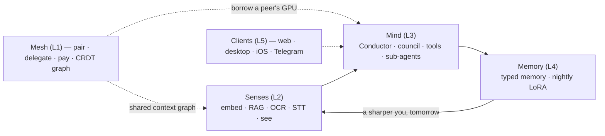
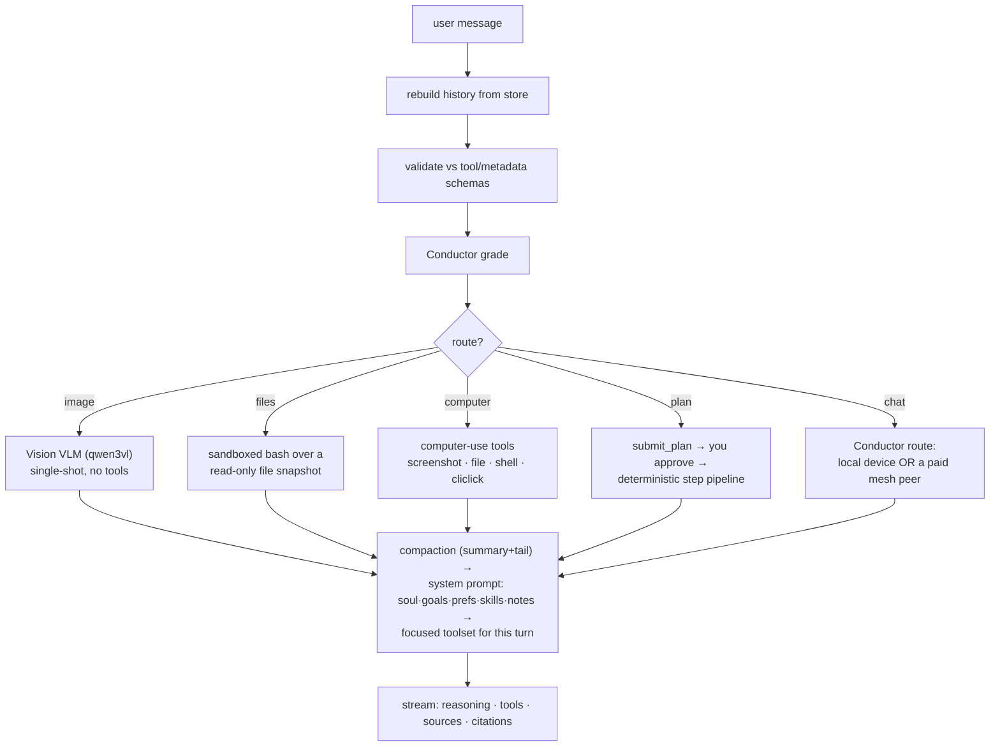
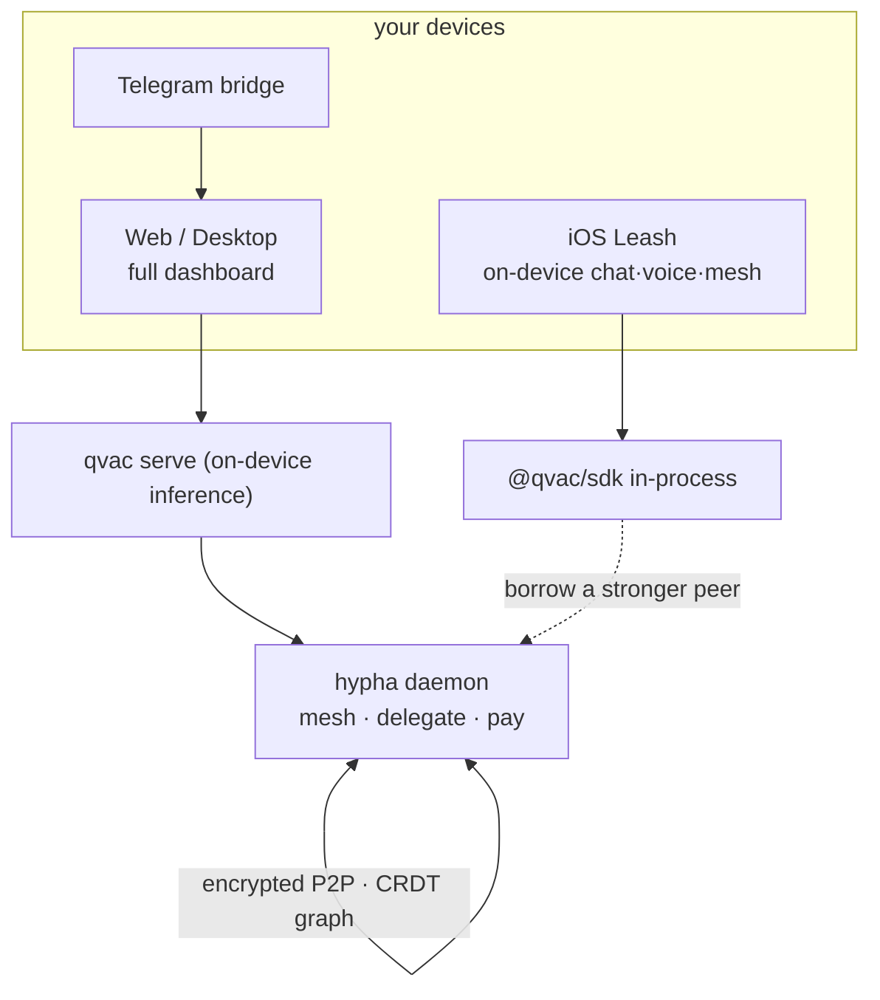

# Mycelium · Leash

> **Leash** is a private, offline, **end-to-end-encrypted AI that lives on your own
> devices — no cloud.** It perceives your world, reasons above its weight class by
> splitting work across your devices, verifies before it speaks, acts on its own
> against goals you set, and learns *you* overnight. When a turn needs more compute than
> the device in your hand, it **borrows a stronger peer over an encrypted mesh — and pays
> for it on-chain** when that peer isn't yours. **Mycelium** is the five-layer engine
> underneath.
>
> Built end-to-end on **[`@qvac/sdk`](https://www.npmjs.com/package/@qvac/sdk)** for
> **QVAC Hackathon I — "Unleash Edge AI"** (Tether). No cloud AI is ever in the loop.
> License: **Apache-2.0**.

**Status (2026-06-20):** ✅ Spike gate **PASSED** (all four primitives GO) · all five
product layers **built for real** · running live across **three Macs + an iPhone**, with
**paid, metered delegated inference** between them. Evidence and reproduction are inside
this repo: [`docs/hackathon/`](docs/hackathon/), [`evidence/`](evidence/), and
[`spike/logs/`](spike/logs/). **No stubs, no mocks** — only working QVAC-backed code ships.

## Judge fast path

| Requirement | Where to verify |
|---|---|
| QVAC-only AI, no cloud LLM calls | [`docs/hackathon/qvac-only-proof.mdx`](docs/hackathon/qvac-only-proof.mdx), [`docs/hackathon/network-disclosure.mdx`](docs/hackathon/network-disclosure.mdx), [`evidence/remote-api-calls.json`](evidence/remote-api-calls.json) |
| Apache-2.0 open source | [`LICENSE`](LICENSE), every tracked `package.json` |
| General Purpose hardware fit | [`docs/hackathon/overview.mdx`](docs/hackathon/overview.mdx), [`docs/hackathon/evidence-and-reproducibility.mdx`](docs/hackathon/evidence-and-reproducibility.mdx) |
| Reproducible local run | [Quickstart](#quickstart), [Reproduce the proofs](#reproduce-the-proofs), [`docs/quickstart.mdx`](docs/quickstart.mdx) |
| Structured audit logs | [`spike/logs/*.jsonl`](spike/logs/), [`evidence/medpsy-demo.jsonl`](evidence/medpsy-demo.jsonl), [`docs/reference/audit-log.mdx`](docs/reference/audit-log.mdx) |
| Judging criteria map | [`docs/hackathon/how-we-meet-the-criteria.mdx`](docs/hackathon/how-we-meet-the-criteria.mdx) |
| Honest limitations | [`docs/hackathon/known-issues.mdx`](docs/hackathon/known-issues.mdx) |

---

## Table of contents

- [The idea](#the-idea) · [The five layers](#the-five-layers) · [Hackathon track fit](#hackathon-track-fit)
- [What's real now](#whats-real-now)
- [How it works](#how-it-works) — turn lifecycle · agents · skills · tools/MCP · mesh · economy · proactivity · memory · understory · clients
- [Repo layout](#repo-layout)
- [Quickstart](#quickstart) · [Reproduce the proofs](#reproduce-the-proofs)
- [Security & privacy](#security--privacy) · [Honest limitations](#honest-limitations) · [Hard rules](#hard-rules) · [Documentation](#documentation)

---

## The idea

One private intelligence distributed across your devices, in a closed loop — perceive,
reason above your weight class, remember, and grow:



Privacy here isn't a constraint — it's the *unlock*. Because everything stays on
hardware you own, Leash can hold your **total context**, reason **above its weight class**
by borrowing a peer's GPU, and **improve itself nightly** — three things a stateless cloud
API structurally cannot do. The context graph feeds reasoning; the council's verified
answers and your feedback feed the nightly LoRA; the improved adapter sharpens the next
day's perception and reasoning. One organism.

### The five layers

| Layer | Role | Where it lives | Status |
|---|---|---|---|
| 1 — **Mesh** | encrypted P2P pairing · delegated/split compute · **paid metered settlement** · replicated CRDT context graph | `packages/mesh`, `apps/hypha` | ✅ live |
| 2 — **Senses** | on-device embeddings · RAG · OCR · STT · screen/photo sensing | `packages/senses`, `apps/leash-watch` | ✅ live |
| 3 — **Mind** | **Conductor** router · proposer+critic council · cited, verified answers · tools · sub-agents | `packages/mind`, `packages/leash-core`, `apps/web` | ✅ live |
| 4 — **Memory** | typed memory + recall + **nightly on-device LoRA** (QVAC Fabric): curate → train → eval → `/grow` → P2P share | `packages/memory` | ✅ live |
| 5 — **Clients** | web dashboard · desktop (Electron) · iOS/Android (Expo) · Telegram bridge | `apps/web`, `apps/desktop`, `apps/mobile`, `apps/leash-telegram` | ✅ live |

Each layer became a real `packages/<layer>` (or `apps/<client>`) workspace **only when its
real implementation landed** — never before.

### Hackathon track fit

- **General Purpose (primary).** Retail devices ≤32 GB RAM (the build runs on an Apple-Silicon Mac
  mini with Mac peers). The track calls for multi-agent orchestration, multimodal work, advanced
  RAG, P2P delegation, LoRA, and privacy-first tooling — the exact surface Leash exercises.
- **Psy Models.** Leash serves QVAC's **MedGemma 4B IT** as a first-class `medpsy` alias and routes
  to it automatically on health intent — health-record RAG, cited + verifier-checked, with a
  guaranteed clinician disclaimer (`npm run medpsy:demo`). Same build, no separate project.

→ [`docs/hackathon/overview`](docs/hackathon/overview.mdx) · [`docs/hackathon/medpsy-workflow`](docs/hackathon/medpsy-workflow.mdx).

---

## What's real now

Every claim below is backed by a JSONL audit record or an on-chain transaction — see
[`docs/hackathon/evidence-and-reproducibility.mdx`](docs/hackathon/evidence-and-reproducibility.mdx)
and the committed [`evidence/`](evidence/) log.

- **On-device inference · RAG · embeddings.** Streaming completions with live `tok/s`;
  RAG grounded in your private notes with `[N]` inline-citation pills. Spike: Llama-3.2-1B
  **TTFT 56 ms / 70.6 tok/s**; RAG retrieval **23 ms**, top score **0.768**; grounding
  verified (no-context → "I don't know"; with context → cited answer).
- **Vision · voice · image-gen, all on-device.** `qwen3vl` answers about a screenshot or
  attached image; Parakeet STT → reply → Supertonic TTS with progressive sentence-by-sentence
  speech, barge-in, and a hands-free **Call** mode; Stable Diffusion image generation.
- **Encrypted P2P delegated compute.** A weak device hands a heavy turn to a strong peer
  over a Noise-encrypted Hyperswarm link. Spike round-trip **1.27 s, TTFT 257 ms, 45.4
  tok/s**; live two-Mac delegated completion measured at **TTFT 317 ms / 100.7 tok/s**;
  broker load-shed answered an overflow turn from a peer in **2.9 s at 100+ tok/s**.
- **A working machine economy.** When the peer isn't yours, the turn is **metered and
  settled on-chain** (x402 / Permit2, USDT0). Proven across two physical Macs: a 286-token
  completion decoded on one Mac for another and settled in a single transaction; **per-chunk
  metered billing** settles the exact highest authorized rung in **one** tx (O(1)
  gas/session); a cheaper provider (`500 µ/ktok` vs `1000`) is selected by the market.
  Wired against a **local `anvil` fork for local testing only** — no real chain is ever touched.
- **The Conductor** routes every turn — local vs. peer — by intent, sensitivity, and live
  capacity, with a **non-overridable privacy gate** (private prompts never reach a public mesh).
- **Acts as an agent system.** Skills that auto-load from natural language and run as
  deterministic pipelines; specialist **sub-agents** (research, coding, medical…) the main
  agent can delegate to; Claude-compatible **plugins** (skills + agents + MCP, quarantined on
  import); per-tool **"Ask first"** approval cards; **computer use** (screenshot · jailed file I/O ·
  shell · mouse/keyboard); **plan mode**; MCP servers with **elicitation** forms rendered in chat.
- **Proactive, not just reactive.** A heartbeat loop reads your **constitution** (soul +
  goals + a watch-checklist) every ~30 minutes during waking hours, runs a read-only agent
  turn, and surfaces budgeted, deduplicated notifications tiered **auto / notify / ask**. Plus
  user-schedulable tasks and nightly jobs (**dream** chat-consolidation, **evolve** LoRA, photo tagging).
- **Ambient sensing.** An opt-in screen watcher (`apps/leash-watch`) captures a frame, has the
  on-device VLM summarize it, and writes an activity trail that feeds RAG and the heartbeat — it
  never leaves the device, and the raw frame is deleted immediately.
- **The Understory — an autonomous paper.** A background newsroom daemon discovers leads, stages a
  personal brief from your private graph, then researches → drafts → reviews → generates hero art →
  publishes editions, all on-device — proof the platform does more than answer direct chat.
- **File attachments.** Attach an **image** (→ vision VLM) **or any text/code/markdown/
  CSV/JSON/log file** (read straight into the chat model). Web + desktop.
- **Nightly self-improvement (memory-evolution loop).** Curates training pairs from your
  memories, chats, and notes; trains a personal LoRA on-device via QVAC Fabric (**152.7 s,
  ~20 MB adapter, val-acc 0.85** at the spike); evals on three axes; charts base-vs-adapter
  at `/grow`; shares the adapter P2P (byte-identical, CRDT-pointered).
- **Clients everywhere.** Web dashboard (Brain · Tasks · Alerts · Economy · Services), an
  Electron **desktop** app, and **iOS Leash** on a real iPhone with on-device voice and full
  dashboard parity.

---

## How it works

This section is the map a judge (or a new contributor) needs: the algorithms, the moving
parts, and how they relate. Each subsystem links to its deep doc under [`docs/`](docs/).

### A chat turn, end to end

The web app (`apps/web/app/api/leash/chat/route.ts`) is an [AI SDK](https://sdk.vercel.ai)
`streamText` loop over a **QVAC local provider** (`@qvac/ai-sdk-provider`) talking to a local
OpenAI-compatible `qvac serve`. The transport sends only the last message + a trigger; the
server rebuilds history from the store. One turn flows through these stages:



Two load-bearing details that make a 4B model behave on-device:

- **Focused toolset per turn.** The serve folds every offered tool schema into a 4096-token
  prompt; offering all ~28 at once hangs the decode at zero tokens (verified 2026-06-07). So a
  computer turn offers only the six computer tools, a skill turn offers exactly its declared
  `tools:`, and everything else keeps the lean registry. Stored threads still validate against
  the full set.
- **Dynamic effort.** Each non-image turn is graded into `quick / standard / deep`, which sets
  step cap, token ceiling, `/no_think` vs full `<think>`, and whether reasoning streams. Voice
  always runs `/no_think` (it must answer in seconds).

### The Conductor — routing local vs. peer

`packages/leash-core/routing` + `apps/web/lib/leash/conductor.ts`. For a generalist chat turn
the Conductor decides *where* it runs:

1. **Fast-path** — a trivial `quick` text turn (arithmetic/greeting/lookup, scored by a
   zero-embed regex + cosine effort classifier) stays on the local device; no classifier LLM call.
2. **Grade** — otherwise a warm **1.7B classifier** (`qwen3-1.7b`) grades the first 2000 chars of
   the turn into an **≤80-token JSON** verdict at `temperature 0`: `{ modality, difficulty,
   sensitivity, specialist }` (`conductor.ts`).
3. **Capability bar** — `difficulty=high` demands a "mid" param-class model; else "small".
4. **Rank** — over the live route options (local warm aliases from `hypha /health`, peers from
   `hypha /peers`): **(1) privacy gate first and non-overridable** — `sensitivity=private`
   rejects any public-tier route; **(2)** filter by modality + param-class + specialist; **(3)**
   score `cost(µ/ktok) + inflight×penalty + tier_bias`, lowest wins.

Specialist routes (vision / files / computer) keep dedicated models and are never overridden;
the route decision streams to the UI as a `data-conductor` part and is audited to
`logs/conductor.jsonl`. → [`docs/explanation/architecture`](docs/explanation/).

### Agents — everything is an agent

Leash *is* the default agent (its system prompt base is `apps/web/builtin-agents/leash.md`).
Specialist agents are markdown files (`data/leash-agents/<slug>.md`, or namespaced
`<plugin>:<name>` from a plugin) with Claude-subagent-compatible frontmatter — `name`,
`description`, `tools` / `disallowed-tools`, `model`, `skills`, `max-turns`, `mcpServers`, plus
reserved fields (`memory`, `permissionMode`, hooks…) parsed for forward-parity. (`agents-store.ts`)

`buildAgentTools` (`agent-runner.ts`) turns each **enabled** agent into ONE callable tool
(`agent__<plugin>__<name>`). When the main model invokes it, the sub-agent runs as an **isolated
`ToolLoopAgent`** with its own model + restricted toolset; its tool calls and text **stream** to
the UI for progress, but `toModelOutput` offloads its full transcript down to just a final summary
for the parent — context stays lean. Sub-agents are **leaf nodes**: they can't call `run_skill` or
invoke other agents, and they can't use approval-gated tools (a stream can't pause on a human
card). `smoke:agents`, `smoke:orchestration`.

### Skills — instructions, pipelines, and progressive disclosure

Skills follow the agentskills.io layout: `data/leash-skills/<slug>/SKILL.md` + `references/` +
`scripts/` + `assets/` (`skills-store.ts`). A skill carries a `body` (instructions), `tools:`,
optional `steps:`, routing `examples:`, and attachment `files:`.

- **Matching** — explicit (`@slug` or exact name) loads a skill deterministically; otherwise a
  semantic router (lexical + embedding RRF, floors lexical ≥0.45 / embedding ≥0.81) may auto-match
  **one** skill. No skill is force-active on a general turn. (`skill-tools.ts`)
- **Progressive disclosure** — an active skill's declared `tools:` *become* that turn's exact
  toolset; the model can still reach the rest of the catalog with `read_skill` / `read_skill_file`
  mid-flow (multi-skill orchestration without bloating context).
- **Deterministic pipeline vs. free-run** — if a skill declares `steps:`, the harness drives each
  step as an isolated `generateText` with prior results fed forward (`runSkillAsPipeline`,
  `skill-runner.ts`); the model does one atomic sub-task per step and can't drop a dependent one.
  This is the single biggest reliability win on a 4B: **pipeline 3/3 vs. free-run ~1/3** on a
  dependent chain (verified 2026-06-12). Skills without `steps:` free-run with their tools.
- **`run_skill`** delegates a sub-task to another skill as a sub-agent; **`run_skill_script`** runs
  a bundled script (node/python/bash by extension, argv-spawn, realpath-jailed, stripped env, 60 s
  SIGKILL, 16 KB caps) — **real code execution as the web-app user, hence approval-gated.** Imports
  and any `SKILL.md` without explicit `enabled: true` land **disabled** (prompt-injection posture).

### Tools & MCP groups

Capability tools are hosted by `apps/leash-tools-mcp` (`:11440`), one MCP server per group on
`/mcp/<group>`: Home-Assistant · Feed · Memory · Tasks · Context · Photos · Image · Research ·
Skills · Computer · Files · Scheduler · Router · MCP-admin. Each group toggles independently
(Brain → Tools); `leashMcpTools()` merges the enabled groups + any user-added MCP servers
(`data/leash-mcp.json` / `LEASH_MCP_SERVERS`) into the turn's registry. Marked tools are
**approval-gated** ("Ask first" → an in-chat Approve/Deny card; Deny is acknowledged, never
retried). Leash advertises MCP **elicitation**, so a server can render a typed form
(string/number/boolean/enum) mid-call — e.g. the bundled `leash-mcp` (`:11439`) turns *"pair this
device with my laptop"* into a 6-digit-PIN prompt.

### The mesh — pairing, CRDT graph, delegated compute

`apps/hypha` is the headless daemon each device runs (`:11437`): it joins the encrypted mesh,
serves a delegated-inference **provider** (firewall = paired peers only), pre-warms peer models,
and exposes a local OpenAI **shim** so the web app can borrow a peer transparently. Devices share
**one replicated context graph** over multi-writer **Autobase** (Hypercore/Hyperbee) — a node
sensed on one device becomes queryable on another, with **CRDT** tombstones/retractions giving
deterministic, offline-safe convergence. Models distribute P2P too (mac3 pulled Qwen3-4B,
**2382 MB in 159 s**, zero cloud). `smoke:registry`, `smoke:failover`, `mesh:smoke`,
`test:mesh:tasks`. → [`docs/help/operations-mesh`](docs/help/).

### The economy — metered, settled, self-hosted

When a borrowed peer isn't yours, hypha meters the work and settles it via a **self-hosted x402
facilitator** (EVM/Permit2, USDT0). A **metered session** authorizes spend as an escalating
ladder of rungs (`HYPHA_ECONOMY_CHUNK_TOKENS`); the provider settles the **single highest
authorized rung** in one transaction (O(1) gas), with an idle watchdog
(`HYPHA_ECONOMY_ADVANCE_WINDOW_MS`) that force-settles a stalled consumer. Receipts replicate
through CRDT; reputation scoring catches self-dealing (one-payer volume scores below many-payer).
**Off by default** (`HYPHA_ECONOMY_ENABLED=0`). **The economy is wired against a local `anvil`
fork of Plasma testnet (chain `9746`) for local testing only** — it is pure localhost, no real
chain is ever touched, and there is no public-chain or hosted-market deployment. It's a
metering/trust mechanism for borrowing your own (or a friend's) device, not a compute marketplace.
See [Reproduce the proofs](#reproduce-the-proofs), [`docs/platforms/economy`](docs/platforms/economy.mdx),
and the runbook [`docs/help/local-settlement-anvil.mdx`](docs/help/local-settlement-anvil.mdx).

### Proactivity — the heartbeat and the constitution

Leash acts on its own. Your **constitution** is three editable markdown files —
`soul.md` (who you are), `goals.md` (what you're working toward), `heartbeat.md` (what to watch)
— edited at **Brain → Proactivity** (`constitution.ts`, `ProactivityPanel.tsx`). `soul` + `goals`
inject into **every** chat turn (goal-aware on demand), and an `mcp-cron` schedule fires
`runHeartbeat()` (`apps/web/lib/leash/heartbeat.ts`) ~every 30 min within waking hours
(09:00–22:00, daily budget). The heartbeat reads recent screen activity + the checklist, runs a
**propose-only, read-only** agent turn (`search_graph`, `recall`, `understory_search`,
`create_task`), then — if the proposal is non-empty, on-goal, within budget, and not a duplicate
(exact + embedding dedup) — classifies it **auto / notify / ask** and writes a notification
(bell feed + OS toast on desktop). The same scheduler runs **user-defined tasks** and the nightly
jobs — **`dream`** (consolidates the day's chats into typed memory), **`evolve`** (the LoRA below),
and photo tagging. → [`docs/agents/heartbeat`](docs/agents/heartbeat.mdx), [`docs/capabilities/scheduler`](docs/capabilities/scheduler.mdx).

### Memory — the nightly evolution loop

`packages/memory` curates training pairs from typed memory + chats + notes (zero eval-leak,
dedupe, a min-pair gate), trains a personal adapter on-device via **QVAC Fabric**, evals it on
three axes, and renders base-vs-adapter at `/grow`. The adapter publishes as Hypercore blob chunks
with a CRDT pointer (LWW newest-wins; corrupt/truncated transfers are rejected on sha256). Set
`LEASH_CHAT_MODEL=qwen3-4b-me` to chat with your nightly self. `memory:smoke`, `evolve`,
`medpsy:demo`. → [`docs/explanation/the-memory-evolution-loop`](docs/explanation/the-memory-evolution-loop.mdx).

### The Understory — the autonomous paper

The newsroom daemon (`apps/newsroom`) is the clearest proof Leash does more than answer chat. On a
cadence it (1) discovers fresh leads from your feeds, (2) stages a **personal brief** from your
private graph (offline), then (3) drains a queue one article at a time through the full pipeline —
**research → draft → review claims → on-device hero art → publish** — emitting a `DaemonRun` + audit
record per step. It reads at **Paper** in the dashboard. → [`docs/explanation/what-the-understory-is`](docs/explanation/what-the-understory-is.mdx).

### Clients — same engine, different reach

Every client drives the same Mycelium engine; what differs is *where* the work runs and how much
of the dashboard a device can host. Deep docs: [`docs/platforms/`](docs/platforms/) and
[`docs/install/`](docs/install/).



- **Web** (`apps/web`) — the full surface: chat, Brain (Models · Skills · Tools · Agents · MCP ·
  Proactivity), Tasks, Alerts, Economy, Services. Everything else wraps it. → [`docs/platforms/overview`](docs/platforms/overview.mdx)
- **Desktop** (`apps/desktop`, Electron, macOS) — **not a separate UI**: an Electron window around
  the *same web app + shared supervisor* (`apps/web/server-launch.mjs`). It picks a data folder on
  first run, then **downloads the qvac runtime + daemons on demand** (sha256-verified) so the DMG
  stays small, runs Node *via Electron's own binary* (no system Node needed), and fires **native OS
  notifications** for heartbeat alerts. Packaging compromises (all documented): the SDK is
  root-hoisted and ships `node-gyp-build` prebuilds, so `install-app-deps` / `npmRebuild` are **off**
  (an in-place rebuild would break the Node daemons); an `after-pack` hook restores the standalone
  `node_modules` electron-builder strips; and the `.app` gets a **deep ad-hoc re-sign** with
  JIT/WASM/dyld entitlements (notarization is manual). → [`docs/platforms/desktop`](docs/platforms/desktop.mdx)
- **Mobile** (`apps/mobile`, Expo/React Native — **iOS Leash**) — runs `@qvac/sdk` **on-device in
  the JS thread**, no server: on-device chat (selectable Qwen3 0.6B/1.7B/4B + Llama 1B, 4k ctx),
  **on-device voice** (Whisper STT → reply → Supertonic TTS with VAD, progressive playback,
  barge-in), real **mesh membership** (a Bare worklet replicates the task CRDT P2P), and delegated
  inference to a stronger peer. Compromises: **JSC, not Hermes** (Hermes 0.81.5 can't compile the
  SDK's RN polyfills); **mesh is iOS-only** (the Bare runtime has no Android build → Android runs
  chat only); the **heartbeat loop, RAG recall, tools/skills, LoRA and the economy run on desktop**
  (the phone shows an honest "runs on desktop" note, never a fake panel); **real device only** (no
  simulator — the native bindings need Metal/Vulkan). → [`docs/platforms/mobile`](docs/platforms/mobile.mdx) · [`docs/install/ios`](docs/install/ios.mdx)
- **Telegram** (`apps/leash-telegram`) — an owner-only bridge: messages POST to your local Leash;
  inference still runs on your device. → [`docs/channels/telegram`](docs/channels/telegram.mdx)

---

## Repo layout

```
mycelium/
  packages/
    shared/        # foundation: DeviceCapability, AuditRecord, GraphNode, logger (no SDK dep)
    senses/        # L2: context-graph nodes · RAG index · STT/OCR · incremental embed
    mind/          # L3: council (proposer+critic) · router · generic runAgent + tool registry
    mesh/          # L1: delegated-inference provider/consumer · MeshGraph (CRDT sync + adapter share)
    memory/        # L4: curate → nightly LoRA → 3-axis eval → adapter manifest + apply
    leash-core/    # shared backing for Leash: agents · skills · tools-groups · routing · stores · vault
    db/            # Prisma schema + generated client
  apps/
    web/           # Leash dashboard (Next.js) — chat = AI SDK + @qvac/ai-sdk-provider; Brain/Tasks/Economy
    desktop/       # Electron client — bundles the QVAC runtime + Leash daemons + OS notifications
    mobile/        # Expo (React Native) — iOS Leash (JSC), on-device voice + dashboard parity
    hypha/         # headless mesh daemon: delegated provider · OpenAI shim · economy · CRDT graph
    leash-broker/  # priority queue / reverse-proxy in front of qvac serve (wedge-safe, load-shed)
    leash-mcp/     # MCP server — mesh pairing exposed as chat tools (PIN/device elicitation)
    leash-tools-mcp/ # MCP daemon hosting each capability group (HA·Memory·Tasks·Photos·…) per-path
    leash-watch/   # on-device activity sensing (capture → VLM summary → activity trail)
    leash-telegram/  # owner-only Telegram bridge to the local Leash agent
    newsroom/      # autonomous editor daemon (discover → brief → research → draft → publish)
    hub/  edge-node/ # original mesh demo: strong "brain" + weak "phone" over a CRDT graph
    landing/       # marketing site
  spike/           # the de-risk gates (runnable, proven GO) — see "Reproduce the proofs"
  scripts/         # smoke/gate/probe tests + anvil-plasma-setup.sh
  patches/         # patch-package patches over @qvac/cli (e.g. multimodal chat — tetherto/qvac#2459)
  docs/            # Mintlify docs site (the ONLY product-docs markdown allowed in mycelium/)
  evidence/        # committed audit-log evidence (e.g. medpsy-demo.jsonl)
  qvac.config.base.json   # serve config (~/.qvac/... paths) — wrapped by qvac.config.mjs
```

Full product documentation (vision, architecture, hackathon criteria, evidence, known issues)
lives in [`docs/`](docs/) — start at [`docs/index.mdx`](docs/index.mdx) and
[`docs/hackathon/`](docs/hackathon/). The SDK reference is the published
[`@qvac/sdk`](https://www.npmjs.com/package/@qvac/sdk) package.

---

## Quickstart

**Prerequisites:** Node ≥ 22 (developed on v24.13), npm 11+. Internet **once** to warm the model
cache; fully offline thereafter.

```bash
cd mycelium
npm install
npm run spike:warm        # one-time, online: downloads GGUF weights + bootstraps the DHT
```

Run Leash — three processes (model server, dashboard, and optionally the mesh daemon):

```bash
# Terminal A — the on-device model server (qvac serve). Loads qvac.config.mjs:
#   qwen3-4b chat + gte-large embeddings + vision/STT/TTS aliases, tools enabled.
npm run qvac              # → OpenAI-compatible server on http://127.0.0.1:11435/v1

# Terminal B — the dashboard. Open http://localhost:6801 (→ /chat); "Paper" = The Understory.
npm run web:dev

# Terminal C (optional) — join the encrypted mesh + serve/borrow delegated compute.
npm run hypha            # → daemon on :11437; pre-warms peer models, OpenAI shim, economy
```

Other clients, same engine:

```bash
cd apps/desktop && npm run dev     # Electron desktop app
cd apps/mobile  && npm run ios     # iOS Leash on a connected iPhone (Expo dev-client)
```

### Key env vars (web)

| env | default | purpose |
|---|---|---|
| `QVAC_OPENAI_URL` | `http://127.0.0.1:11435/v1` | local QVAC server the provider targets (point at `:11436` to go via the broker) |
| `LEASH_CHAT_MODEL` | `qwen3-4b` | chat model alias (must match the serve config); `qwen3-4b-me` chats with your nightly LoRA |
| `LEASH_EMBED_MODEL` | `gte-large` | embedding alias for `search_graph` |
| `LEASH_BROKER_HYPHA_URL` | `http://127.0.0.1:11437` | hypha daemon the Conductor queries for peer routes |
| `LEASH_COMPUTER_MODEL` | _(= chat model)_ | larger alias for computer-use turns, optionally served on a mesh peer |
| `LEASH_MCP_SERVERS` | _(empty)_ | comma-separated MCP server URLs merged into the registry |
| `LEASH_HA_URL` / `LEASH_HA_TOKEN` | _(empty)_ | Home Assistant base URL + long-lived token (server-side only) |

| port | service |
|---|---|
| `6801` | web dashboard · `11435` qvac serve · `11436` broker · `11437` hypha · `11439` leash-mcp · `11440` tools-mcp · `8545` anvil (economy) |

---

## Reproduce the proofs

Everything is real — real inference, real encrypted P2P, real on-chain settles on a local fork.
Each spike prints to stdout **and** appends JSONL audit records under `spike/logs/`.

**The spike gate — the four de-risked primitives:**

```bash
npm run spike:inference          # (a) on-device streaming + embeddings + tok/s
npm run spike:rag                # (b) on-device RAG: grounded, cited answer
npm run spike:p2p:provider       # (c) prints a provider public key …
npm run spike:p2p:consumer -- <provider-public-key>   #   … encrypted delegated compute
npm run spike:lora               # (d) on-device LoRA via QVAC Fabric; base vs adapter
npm run spike:autobase hub       # bonus: CRDT graph-sync gate (prints an invite)
npm run spike:autobase edge <invite>
```

→ recorded GO/NO-GO + how to regenerate from a fresh clone:
[`docs/hackathon/evidence-and-reproducibility.mdx`](docs/hackathon/evidence-and-reproducibility.mdx).

**Layer + feature smokes** (pure, fast, no network):

```bash
npm run senses:smoke             # L2: graph RAG pipeline
npm run mind:smoke               # L3: tool-calling council
npm run memory:smoke             # L4: memory curation for the nightly LoRA
npm run mesh:smoke               # L1: CRDT graph replication (bidirectional)
npm run smoke:agents             # sub-agent delegation
npm run smoke:orchestration      # skill/agent orchestration
npm run smoke:chat-attachments-text   # any-file attachments → model input
npm run medpsy:demo              # Psy-track: MedGemma grounded in health records, cited+verified
npm run typecheck                # tsc -b across the workspaces
```

**The economy on a local anvil fork** (no real chain is touched — chain `9746`, RPC `:8545`):

```bash
# 1. bring up the fork + facilitator state (idempotent; re-run after any anvil restart)
scripts/anvil-plasma-setup.sh
# 2. confirm settlement end-to-end (real ethers wallets, real on-fork settles)
npm run smoke:metered            # escalating-authorization ladder, replay-guards, idle watchdog
npm run smoke:identity           # wallet↔provider-key binding + on-chain receipt verification
npm run smoke:reputation         # self-dealing scores below honest multi-payer volume
npm run gate:firewall-revocation # a revoked consumer is cut off cleanly
```

Full runbook (clock-drift + RPC gotchas): [`docs/help/local-settlement-anvil.mdx`](docs/help/local-settlement-anvil.mdx).

**Offline acceptance** — after warming the cache, disable networking (airplane mode / pull the
cable) and re-run `spike:inference`, `spike:rag`, and the Mac↔Mac `spike:p2p:*` pair. They must
still produce tokens and grounded answers with **zero connectivity** — that's the release bar.

---

## Security & privacy

Privacy is the architecture, not a setting:

- **On-device only — no cloud AI.** Every inference, embedding, RAG retrieval, and multimodal call
  routes through `@qvac/sdk` to a local serve; a single cloud-AI call would disqualify the submission.
  → [`docs/hackathon/qvac-only-proof`](docs/hackathon/qvac-only-proof.mdx).
- **Encrypted P2P, firewalled.** Mesh links are Noise-encrypted over Hyperswarm; the provider
  firewall admits only paired peers; the Conductor's **privacy gate is non-overridable** — a
  `private` turn never routes to a public mesh.
- **Jailed + gated execution.** Computer-use / file tools are realpath-jailed under
  `LEASH_COMPUTER_ROOT`; shell/file/MCP tools are **approval-gated** ("Ask first"); imported skills
  and plugins land **disabled (quarantined)** until you review and enable them.
- **Your data stays yours.** Per-user data dir; raw screen-watcher frames are deleted immediately
  after the on-device VLM reads them; exactly what touches the network, and when, is itemized in
  [`docs/hackathon/network-disclosure`](docs/hackathon/network-disclosure.mdx).

---

## Honest limitations

The judging framework rewards transparency; the single source of truth is
[`docs/hackathon/known-issues.mdx`](docs/hackathon/known-issues.mdx). In brief:

- **Partial — computer-use over the mesh.** Local computer-use (screenshot · jailed file I/O ·
  shell · `cliclick`, approval-gated) works; routing the *computer* model to a peer
  (`LEASH_COMPUTER_MODEL`) is wired but not yet hardened in a live two-Mac run.
- **By design — the economy is personal-device P2P.** It settles against a local anvil fork, not
  a public chain; it's a metering/trust mechanism for borrowing your own (or a friend's) device,
  not a hosted compute market.
- **Pending — airplane-mode re-run on the final build.** Proven in Week 1; must be re-run on the
  shipped build before we call it *passing* (until then: *expected to pass*).
- **Resolved (was broken).** On-device TTS (`supertonic`, current 0.13.5 runtime) and **cross-mesh vision
  delegation** now work — the serve's `/v1/chat/completions` accepts OpenAI multimodal `image_url`
  content (upstreamed as **tetherto/qvac#2459**, applied in-tree via
  [`patches/`](patches/)), so a consumer can borrow a peer's GPU for an *image* turn.

On-device text-to-video (Wan 2.1) OOMs on the 24 GB M4 and is deferred — see known-issues for the
full, unsanded list.

## Hard rules

- **All inference / embeddings / RAG / fine-tuning via `@qvac/sdk` only** — never a cloud API.
- **Apache-2.0**, fully open-source and reproducible.
- How we meet each judging criterion:
  [`docs/hackathon/how-we-meet-the-criteria.mdx`](docs/hackathon/how-we-meet-the-criteria.mdx);
  proof that nothing leaves the device:
  [`docs/hackathon/qvac-only-proof.mdx`](docs/hackathon/qvac-only-proof.mdx).

## Documentation

The full Mintlify site is in [`docs/`](docs/) (start at [`docs/index.mdx`](docs/index.mdx)):

- **Get started / install** — [`docs/quickstart`](docs/quickstart.mdx), [`docs/install/`](docs/install/) (macOS · iOS · Android · Windows · Linux)
- **Channels** — [chat](docs/channels/chat.mdx) · [voice](docs/channels/voice.mdx) · [computer-use](docs/channels/computer-use.mdx) · [mobile](docs/channels/mobile.mdx) · [telegram](docs/channels/telegram.mdx)
- **Capabilities** — [skills](docs/capabilities/skills.mdx) · [tools](docs/capabilities/tools.mdx) · [plugins](docs/capabilities/plugins.mdx) · [scheduler](docs/capabilities/scheduler.mdx) · [MCP](docs/capabilities/mcp.mdx)
- **Agents & routing** — [architecture](docs/explanation/architecture.mdx) · [council](docs/agents/council.mdx) · [delegation](docs/agents/delegation.mdx) · [sub-agents](docs/agents/subagents.mdx) · [heartbeat](docs/agents/heartbeat.mdx)
- **Mesh & economy** — [the hypha daemon](docs/explanation/the-hypha-daemon.mdx) · [the agent economy](docs/explanation/the-agent-economy.mdx) · [mesh & membership](docs/explanation/mesh-and-membership.mdx)
- **Models** — [overview](docs/models/overview.mdx) · [catalog](docs/models/catalog.mdx) · [aliases](docs/models/aliases.mdx)
- **Reference** — [ports & processes](docs/reference/runtime-ports-and-processes.mdx) · [scripts & smoke tests](docs/reference/scripts-and-smoke-tests.mdx) · [benchmarks](docs/reference/benchmarks.mdx) · [workspace map](docs/reference/workspace-map.mdx)
- **Hackathon** — [overview](docs/hackathon/overview.mdx) · [criteria](docs/hackathon/how-we-meet-the-criteria.mdx) · [evidence](docs/hackathon/evidence-and-reproducibility.mdx) · [known issues](docs/hackathon/known-issues.mdx)
