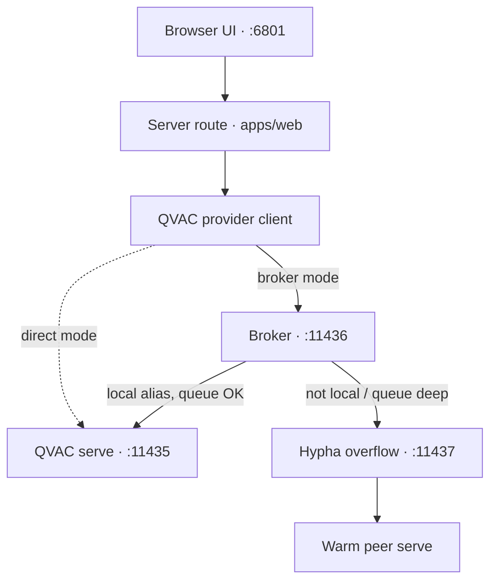

Mycelium is organized as a layered local system rather than a single app process. The
layers matter because they reflect the hard constraints: QVAC-only inference,
offline-first operation, and optional delegation to your own peers.

## The five layers

1. **Mesh** handles pairing, encrypted peer routing, delegated compute, and replicated
   graph transport.
2. **Senses** ingests notes, voice, photos, and activity into local retrieval-friendly forms.
3. **Mind** routes requests, chooses tools, and runs the main reasoning loops.
4. **Memory** curates, evaluates, and trains longer-lived personal adaptations — including the
   nightly LoRA loop described in [The memory evolution loop](/explanation/the-memory-evolution-loop).
5. **Clients** expose the system through the web app, the desktop app, and narrower runtime apps.

## The common local request path

The main Leash path looks like this:

The model weights do not live in the web app. They live in the serve. Everything above
the serve is a client of that process.

## Why the broker exists

The serve is treated as a scarce local resource. Multiple OS processes can try to use it
at once: chat, retrieval helpers, background workers, watcher flows, and delegated paths.
The broker centralizes queueing, aging, and overflow decisions so those callers do not
fight each other blindly.

## Why Hypha exists

Hypha separates mesh concerns from the web app. Pairing, peer health, warm-model
tracking, and delegated-compute control are long-lived concerns. They fit a daemon much
better than a browser-bound request handler. The same daemon owns the forward path for
[borrowed modalities](/explanation/modality-borrowing) and, when enabled, the
[agent economy's](/explanation/the-agent-economy) metering and settlement — because billing a
borrowed turn belongs next to the routing decision that produced it, not in the UI.

## Where the memory loop runs

The first four layers serve requests in the foreground; the **memory** layer mostly runs in the
background. The nightly evolution job — curate, train, evaluate, apply, share — is scheduled by
the cron daemon and writes its adapter back into the serve as a `<base>-me` alias, which then
replicates to peers over the mesh. It is the one path that changes the model itself rather than
just the prompt; see [The memory evolution loop](/explanation/the-memory-evolution-loop).

## What delegation moves, and what it doesn't

A defining constraint runs through the whole architecture: the QVAC SDK delegates **inference
only**. `completion()` and the other OpenAI-shaped endpoints can run on a peer; `ragIngest` and
`ragSearch` have no delegate option. So retrieval is always **local**, run against a
CRDT-replicated graph that every member converges on — the graph travels to the device, the search
runs on the device, and your private corpus never leaves it. The [Hypha daemon](/explanation/the-hypha-daemon)
forwards inference between peers; the [task and graph sync](/explanation/mesh-task-sync) keeps the
underlying graph consistent so a local search sees the same world a peer would.

This split is also why the **Mind** layer runs a council rather than a single delegated call. A
proposer (which may call `search_graph` locally) and a separate verifier each issue `completion()`
— and those completions can run on a warm peer while retrieval stays home. On the same model and
hardware, the council out-reasons a lone model: it catches the small-model failure of retrieving
the right source but dropping the citation. Borrowing a stronger brain for the reasoning while
keeping retrieval and orchestration local is the architectural payoff of inference-only delegation.

Warm provider-side state can be reused across delegated turns where it's safe to — see
[KV-cache delegation](/explanation/kv-cache-delegation) for how a provider reuses a session's KV
cache instead of re-prefilling every borrowed turn.

## Why membership changes are idempotent

The delegation firewall is a **union** of every mesh's allowed-consumer set, reconciled by the
daemon, not a flag flipped per request. The provider stops and restarts with the new allow-list
**only when the union actually changed**, so re-applying the same membership is a no-op and a clean
stop→restart is the way to change who may borrow your models — including revoking one peer without
disturbing live links to the rest. That idempotence is what makes membership a piece of converged
state rather than a fragile sequence of mutations.

## Why the docs split lookup from explanation

In the old docs, architecture pages also tried to carry port numbers, config defaults,
and operator steps. Those facts change for different reasons than the architecture does.
This rebuild keeps the mental model here and moves the facts to reference pages.
