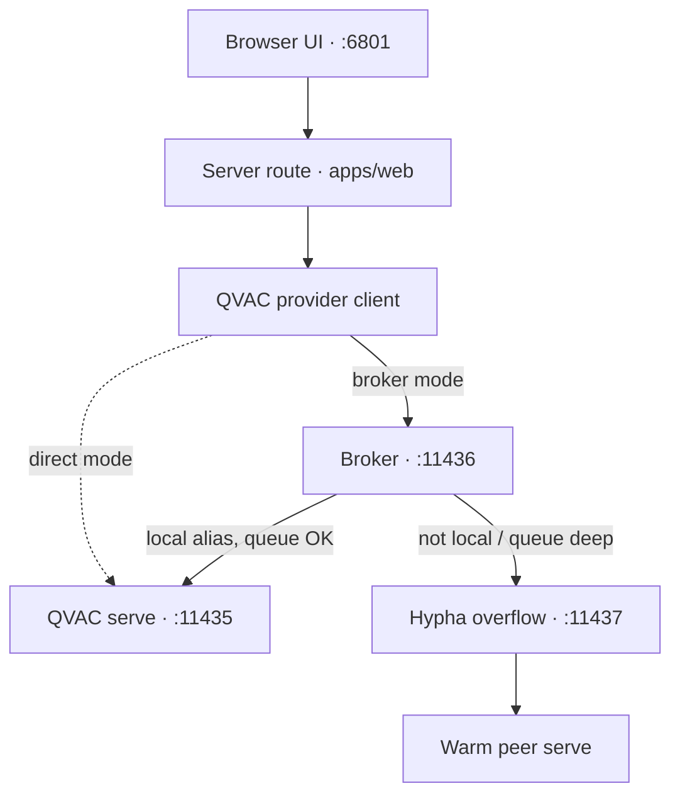

Mycelium is organized as a layered local system rather than a single app process. The
layers matter because they reflect the hard constraints: QVAC-only inference,
offline-first operation, and optional delegation to your own peers.

## The five layers

1. **Mesh** handles pairing, encrypted peer routing, delegated compute, and replicated
   graph transport.
2. **Senses** ingests notes, voice, photos, and activity into local retrieval-friendly forms.
3. **Mind** routes requests, chooses tools, and runs the main reasoning loops.
4. **Memory** curates, evaluates, and trains longer-lived personal adaptations — including the
   nightly LoRA loop described in [The memory evolution loop](/explanation/the-memory-evolution-loop).
5. **Clients** expose the system through the web app, the desktop app, and narrower runtime apps.

## The common local request path

The main Leash path looks like this:

The model weights do not live in the web app. They live in the serve. Everything above
the serve is a client of that process.

## Why the broker exists

The serve is treated as a scarce local resource. Multiple OS processes can try to use it
at once: chat, retrieval helpers, background workers, watcher flows, and delegated paths.
The broker centralizes queueing, aging, and overflow decisions so those callers do not
fight each other blindly.

## Why Hypha exists

Hypha separates mesh concerns from the web app. Pairing, peer health, warm-model
tracking, and delegated-compute control are long-lived concerns. They fit a daemon much
better than a browser-bound request handler. The same daemon owns the forward path for
[borrowed modalities](/explanation/modality-borrowing) and, when enabled, the
[agent economy's](/explanation/the-agent-economy) metering and settlement — because billing a
borrowed turn belongs next to the routing decision that produced it, not in the UI.

## Where the memory loop runs

The first four layers serve requests in the foreground; the **memory** layer mostly runs in the
background. The nightly evolution job — curate, train, evaluate, apply, share — is scheduled by
the cron daemon and writes its adapter back into the serve as a `<base>-me` alias, which then
replicates to peers over the mesh. It is the one path that changes the model itself rather than
just the prompt; see [The memory evolution loop](/explanation/the-memory-evolution-loop).

## Why the docs split lookup from explanation

In the old docs, architecture pages also tried to carry port numbers, config defaults,
and operator steps. Those facts change for different reasons than the architecture does.
This rebuild keeps the mental model here and moves the facts to reference pages.
