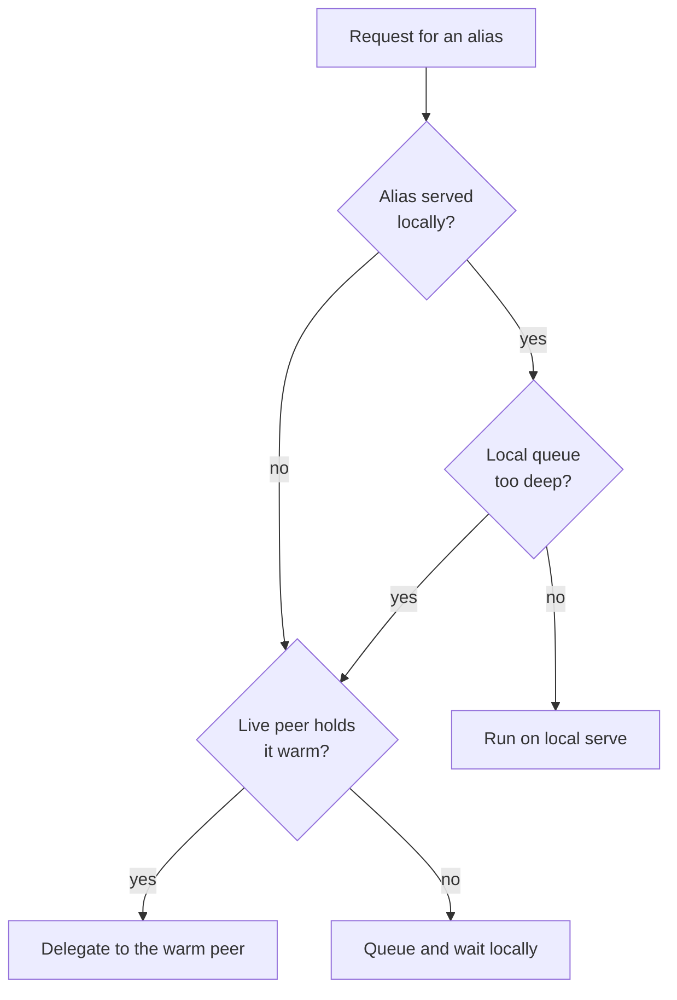

Mycelium's mesh routing is not a generic service mesh. It is a local-first borrowing
system for model work across your own paired devices.

## The local-first rule

Every request starts with the assumption that the local machine should do the work. The
mesh becomes relevant only when another device can help and is already in a good state to
help.

## The broker's role

The broker watches two things:

- whether the local alias is available
- whether the local queue is too deep

If the alias is not served locally, or if the queue is already backed up, the broker can
ask Hypha whether a live peer holds that alias warm. If no such peer exists, the request
waits locally.

## The warm-peer rule

Routing is intentionally biased toward peers that already hold the alias warm. The goal
is not to invent distributed scheduling in the abstract. The goal is to avoid paying a
cold-start penalty on the request path whenever possible.

## What Hypha contributes

Hypha maintains the peer picture that the broker depends on:

- who is paired
- who is live
- which aliases each peer can actually serve
- whether delegated sessions can reuse provider-side KV cache

This lets the web app stay small and stateless while Hypha carries the mesh-specific
state.

## Why routing is conservative

The system is conservative because local AI runtimes are fragile in different ways than
cloud queues. Aborting a generation or misrouting a request can wedge the serve. Overly
aggressive routing can also send work to a peer that looks available but is not actually
ready. The current design prefers slower but legible behavior over cleverness.

## What never leaves the device: RAG search

Delegation moves *inference*, never *retrieval*. The QVAC SDK delegates `completion()` (and the
other OpenAI-shaped endpoints the forward path carries — chat completions, audio transcription,
vision); `ragIngest` and `ragSearch` have **no delegate option** at all. They are local calls
against the device's own workspace (`packages/senses/src/rag-index.ts` imports `ragSearch` straight
from `@qvac/sdk` and runs it in `searchGraph`). There is no "search the peer's graph" request to
make.

This is a constraint that shaped the design rather than a limitation to apologize for. Because a
device can't borrow another's retrieval, each device runs search locally over a **CRDT-replicated
graph** — the same membership-and-content Autobase that every member converges on. The graph
replicates to you; the search runs on you. A delegated completion then reasons over context its
caller already retrieved, so the private corpus never has to travel to the model.

## Why a council beats a single model

The Mind layer doesn't send one prompt to one model. It runs a **council**: a proposer that may
call `search_graph` and answer, then a separate verifier pass that checks the claims. The split
exists because a single small model is exactly the failure mode you'd expect — it can retrieve the
right source and still drop the citation, or answer confidently from parametric memory instead of
the note that actually holds the fact. The proposer/verifier loop catches that: on the same model
and the same hardware, a no-RAG baseline fails to name a fact the graph holds, while the council
retrieves it and cites it.

Routing and the council compose cleanly because the SDK delegates inference only. The proposer and
verifier `completion()` calls can run on a warm peer, while `search_graph` runs locally against the
replicated graph — the council's orchestration stays on the asking device, the heavy reasoning
borrows a stronger brain, and retrieval never leaves home.

## Membership changes are idempotent

The delegation firewall is reconciled, not toggled. When the set of allowed consumers changes,
the daemon stops and restarts the SDK provider with the new allow-list — and **only** when the set
actually changed (a stop→start is not free). So changing who may borrow your models is a matter of
updating the union and letting the provider re-converge; re-applying the same membership is a no-op.
The same idempotence is why a provider can stop→restart to revoke a peer cleanly without dropping a
live link to everyone else. See [The Hypha daemon](/explanation/the-hypha-daemon) for where that
union firewall lives.
