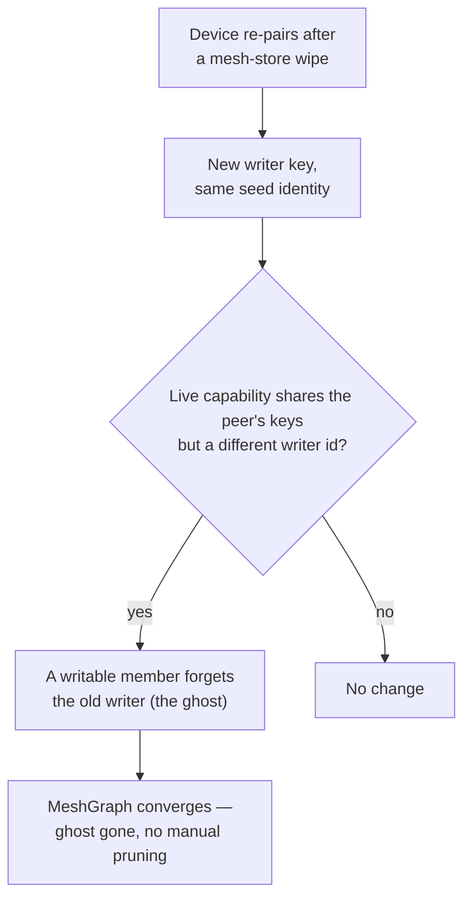

A single paired pair of machines is the simple case. The real model is richer: a device can
belong to **several meshes at once**, each with its own visibility and reach, and every
member converges on the same membership state through a replicated CRDT. This page explains
that model. For the steps to pair, invite, and leave, see
[Pair a second device](/guides/pair-a-second-device) and the
[Device mesh](/guides/mesh) guide.

## Why more than one mesh

One flat mesh forces every device into the same trust circle. Membership is instead organized
along two axes:

- **Visibility** — `private` (your own encrypted circle) or `public` (a broadcast-only cell).
- **Reach** — `local` (compute-bearing peers you route work to) versus broadcast cells that
  carry no compute and no firewall.

A device keeps one **primary** mesh (tier 0, private, local) that anchors its identity, and
any number of **secondary** meshes (higher tiers) it has joined. Routing respects visibility:
a private request fails closed on a public mesh rather than leaking to strangers. That is what
lets you, say, keep a private home mesh and also subscribe to a public cell without the two
mixing.

## The founding writer and invite-as-capability

Meshes are not created by a central server; a device **founds** one. The founder is the
mesh's first writer and its creator — the only member that can delete it. Other devices
**join**, and after they sync they become writers too.

Joining works by capability, not by pre-shared secret. The founder mints a blind **invite**,
and the invite *is* the authorization — whoever holds it can join, and the DHT gossip finds
the peers for them. There is no bootstrap key to copy by hand. (LAN pairing offers a
PIN-and-QR variant for the same handshake; the invite is the programmatic form.)

## Ghosts and supersede cleanup

A device that re-pairs after wiping its local mesh store comes back with a **new writer key**
but the same seed-derived identity. Left alone, its old key would linger in the membership as
a dead "ghost." The mesh detects this: when a live capability shares a peer's provider/consumer
keys but carries a different writer id, the old writer is **superseded** and forgotten
automatically. Only a writable member performs the cleanup, and only for an identity that has
actually reappeared — so the membership self-heals without manual pruning.

## Why a CRDT underneath

Membership has no central authority to ask, so it can't be a request/response table. It is a
**MeshGraph** built on Autobase (multi-writer) over Hyperbee. Every member appends to its own
log; the CRDT merges those logs into one converged view of capabilities, unpair tombstones,
receipts, and the writer set. A rejoin re-binds to the founder's bootstrap key so it reattaches
to the *same* graph rather than forking a new one.

This is also why membership survives restarts and why disconnects are mutual: a tombstone is
just another CRDT record that both sides eventually see, and a **Restore** is the record that
reverses it. The graph — not any one device — is the source of truth.

## How routing reads membership

The mesh layer turns membership into a routing decision. For a given model alias it produces an
ordered list of candidate peers — lowest tier first, visibility-filtered, honoring any hard
mesh pin — and the forward path tries them in order. The companion page
[How the mesh routes work](/explanation/how-the-mesh-routes-work) covers that selection and the
local-first fallback in detail.
