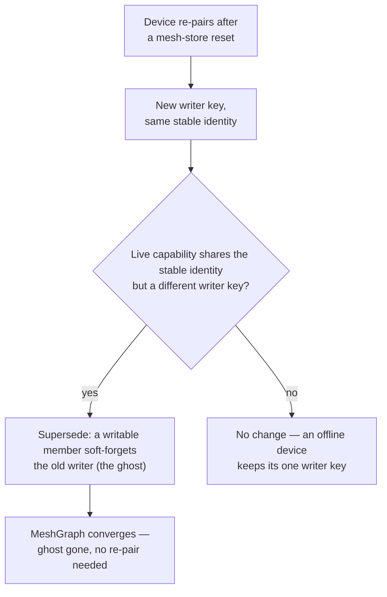

A single paired pair of machines is the simple case. The real model is richer: a device can
belong to **several meshes at once**, each with its own visibility and reach, and every
member converges on the same membership state through a replicated CRDT. "Device" includes the
**iPhone** — it runs the same Corestore + Autobase CRDT as the Macs and is a full writable
member, not a thin client. This page explains that model. For the steps to pair, invite, leave,
and delete, see the [Mesh](/platforms/mesh) guide.

## Why more than one mesh

One flat mesh forces every device into the same trust circle. Membership is instead organized
along two axes:

- **Visibility** — `private` (your own encrypted circle) or `public` (a broadcast-only cell).
- **Reach** — `local` (compute-bearing peers you route work to) versus broadcast cells that
  carry no compute and no firewall.

A device keeps one **primary** mesh (tier 0, private, local) that anchors its identity, and
any number of **secondary** meshes (higher tiers) it has joined. Routing respects visibility:
a private request fails closed on a public mesh rather than leaking to strangers. That is what
lets you, say, keep a private home mesh and also subscribe to a public cell without the two
mixing.

## The founding writer and invite-as-capability

Meshes are not created by a central server; a device **founds** one. The founder is the
mesh's first writer and its creator — the only member that can delete it. Other devices
**join**, and after they sync they become writers too.

Joining works by capability, not by pre-shared secret. The founder mints a blind **invite**,
and the invite *is* the authorization — whoever holds it can join, and the DHT gossip finds
the peers for them. There is no bootstrap key to copy by hand. An invite is single-use and
short-lived; the QR that carries it auto-expires (the desktop invite QR and the phone's camera
scanner both close after 60 seconds), so a stale code on screen is never mistaken for a live one.

## Why a valid invite is necessary but not sufficient

An invite proves *reachability* — it lets a candidate find and decrypt its way to the founder's
graph — but reachability is not membership. The trust model has a second gate. When a candidate
arrives, the host first *decrypts* its handshake to read which writer key is asking to join, and
only *then* decides. Critically, the decrypt step grants nothing: a device becomes a writer only
when the host appends an explicit **add-writer** record to the CRDT. The membership decision lives
entirely in that append, never in the act of opening the candidate's payload.

That ordering is the whole point. The host checks the candidate's writer key against a per-mesh
**allow-list** *before* the add-writer append — so an unlisted device is rejected at the firewall,
before it can ever become a writer. A **closed** mesh carries a non-empty allow-list and admits
only listed keys; an **open** mesh has an empty list and admits any invite-holder. Closing a mesh
is what turns a leaked invite from a real risk into a dead end: the sniffer can reach the graph but
can't pass the firewall.

There are, in fact, two allow-lists guarding two different things, and conflating them is a common
mistake. One gates **pairing** and is keyed by a device's *writer key* — the identity that changes
on every store reset. The other gates **delegated inference** and is keyed by a device's stable
*consumer key* — the seed-derived identity that survives resets. A device you've paired with can
write to the membership graph; a device you've also admitted to your compute firewall can borrow
your models. Keeping them separate is why re-pairing a phone (new writer key) doesn't silently
re-open your compute to it, and why forgetting a peer has to drop *both*. The daemon owns the
compute side as a union across every mesh you're in — see [The Hypha daemon](/explanation/the-hypha-daemon).

For the concrete seven-step handshake and the HTTP routes behind it, see the [Mesh](/platforms/mesh) guide.

## Leaving, deleting, and disconnecting

Three different exits, with deliberately different power:

- **Leave** drops *your own* membership. Any member can leave; the mesh lives on for everyone
  else. It works the same for a private mesh and a public cell.
- **Delete** is the founder's destructive option — only the **creator** can delete a mesh, which
  removes it for this device.
- **Forget a peer** is a *hard disconnect* of someone else: it tombstones them, revokes their
  writer status, and drops them from the compute firewall. Because the tombstone is a CRDT
  record, the disconnect is mutual — both sides converge on it — and a **Restore** record
  reverses it.

The **primary** mesh is the exception to all three: it anchors the device's identity, so it can
never be left or deleted. For the exact steps and the HTTP routes behind each action, see the
[Mesh](/platforms/mesh) guide.

## Device identity, ghosts, and supersede cleanup

A capability is keyed by the device's **autobase writer key** (its `deviceId`), and that key
**changes whenever the device's mesh store is reset or reinstalled**. The iPhone hits this on
every join: it wipes and re-opens its store so a new mesh can't collide with an old one, which
mints a fresh writer key each time. The device's **stable** identity is separate — its
seed-derived provider/consumer key — and that does *not* change across a reset.

So a re-paired device comes back with a **new writer key but the same stable identity**, and
its old key would otherwise linger in the grow-only membership as a dead **"ghost"** (the same
phone shown two or three times). Two cleanups handle this, and the distinction matters:

- **Supersede** (automatic, safe). When a capability shares a peer's stable identity but carries
  a *different* writer key, the older writer is **superseded** — soft-forgotten (its membership
  entry is dropped, nothing else). A writable member does this on every membership change, and
  on each mesh-page load. It only ever fires when an identity has *actually reappeared* under a
  new key, so it never touches a device that is merely offline. This is why a cap **must** carry
  its stable identity: a capability without one can't be grouped, so it can't be superseded.
- **Forget-stale** (manual, destructive). A heavy hammer that drops every peer whose heartbeat
  is older than ~30s — and it *hard-disconnects* them (tombstone + revoke writer + firewall
  cutoff), so a merely-sleeping laptop would have to re-pair. Use it only to clear ghosts left by
  an older build that advertised no stable identity (supersede can't reclaim those on its own).

## Why a CRDT underneath

Membership has no central authority to ask, so it can't be a request/response table. It is a
**MeshGraph** built on Autobase (multi-writer) over Hyperbee. Every member appends to its own
log; the CRDT merges those logs into one converged view of capabilities, unpair tombstones,
receipts, and the writer set. A rejoin re-binds to the founder's bootstrap key so it reattaches
to the *same* graph rather than forking a new one.

This is also why membership survives restarts and why disconnects are mutual: a tombstone is
just another CRDT record that both sides eventually see, and a **Restore** is the record that
reverses it. The graph — not any one device — is the source of truth.

## How routing reads membership

The mesh layer turns membership into a routing decision. For a given model alias it produces an
ordered list of candidate peers — lowest tier first, visibility-filtered, honoring any hard
mesh pin — and the forward path tries them in order. The companion page
[How the mesh routes work](/explanation/how-the-mesh-routes-work) covers that selection and the
local-first fallback in detail.
