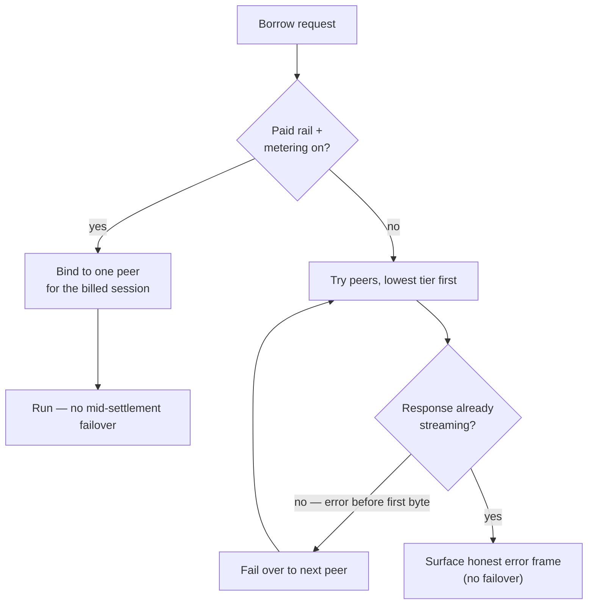

Delegated inference lets a device borrow a *chat* model from a peer. Modality borrowing
generalizes that: a device that lacks vision, embeddings, speech-to-text, or text-to-speech can
borrow that capability from a peer that serves it. This page explains why borrowing non-chat
modalities needs a different transport and what failover looks like. For the steps, see
[Borrow a modality from a peer](/platforms/mesh).

## Why borrow a modality

Not every device can or should run every model. A laptop might keep a strong vision model
warm while a smaller machine runs only chat; a phone-class node may have no embedding model at
all. Rather than force every device to hold every weight, the mesh lets each device advertise
what it serves and lets the others borrow it. The result is one logical assistant whose senses
are pooled across the hardware you own.

## Why a forward path, not SDK delegation

Chat delegation rides the QVAC SDK's own peer-to-peer call. The other modalities can't: vision
turns reference images by **local file path**, which is meaningless on the provider's disk, and
the SDK's delegation doesn't carry embeddings, audio, or speech payloads. So borrowed
modalities travel a separate **forward path** — the consumer's Hypha daemon proxies the full
request to the provider's daemon, which replays it against its own local serve and streams the
result back.

That path is explicit and **off by default** (`HYPHA_FORWARD=0`); enabling it is what makes a
device willing to forward non-chat work. Because the forward path is also where per-modality
metering lives, it is the same path the [agent economy](/explanation/the-agent-economy) bills
when a peer advertises a paid rail.

## What is borrowable

| Modality | Borrowed as | Notes |
|---|---|---|
| Chat | SDK delegation or forward | the original delegated-compute path |
| Vision | forward | images are rebuilt provider-side before inference |
| Embeddings | forward | input tokens metered 1:1 |
| Speech-to-text | forward | audio re-assembled into a file upload on the provider |
| Text-to-speech | forward | audio streamed back as base64 chunks |

A device advertises the aliases it is willing to share; a per-alias deny-set lets you withhold
specific models while sharing the rest, and turning sharing off withholds everything.

## Failover, and where it stops

When several peers can serve the requested alias, the forward path tries them in order and
**fails over** to the next on any error — but only up to the moment a response is committed.
Once the first byte of a streamed answer has been sent to the caller, switching peers would
corrupt the stream, so after that point a mid-stream failure is surfaced as an honest error
frame rather than silently retried.

Settlement narrows this further. If the chosen peer advertises a paid rail and metering is on,
the request is bound to that **one** peer for the life of the billed session — you can't fail
over mid-settlement. Free forwards keep the full failover chain. Correctness and billing
integrity win over squeezing out one more retry.

