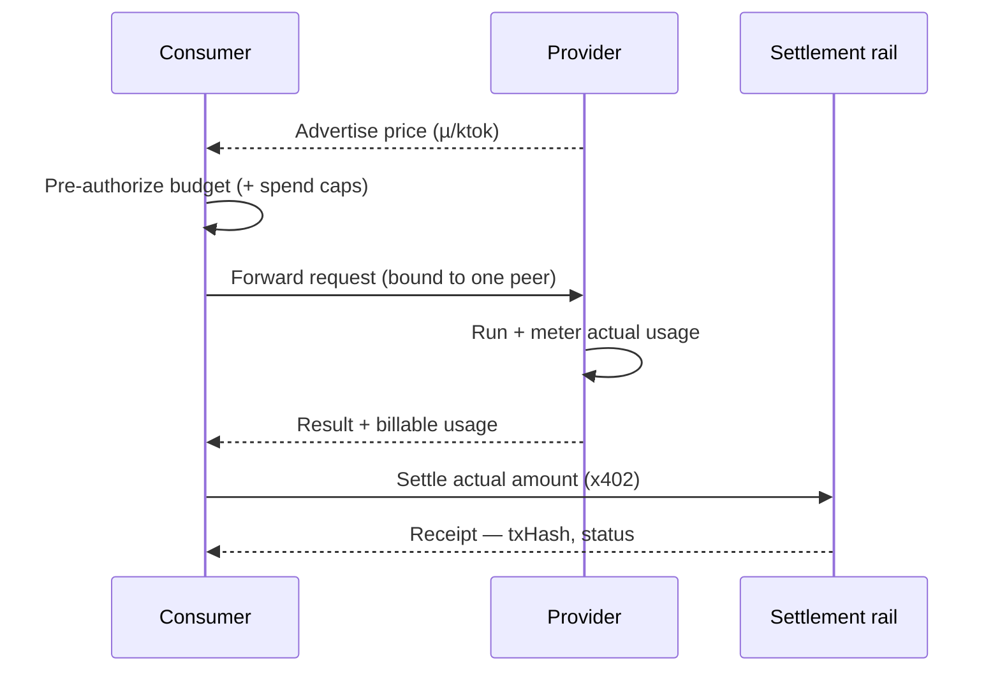

When one device borrows inference from another, somebody's GPU did the work. The agent
economy makes that exchange accountable: a device that serves inference to peers can **earn**,
and a device that borrows inference can **spend**, with each completion settled on-chain. This
page explains why that exists and how the pieces fit. For the operator steps, see
[How to enable the agent economy](/platforms/economy) and the read-only
[Mesh economy](/platforms/economy) guide.

## Why make compute payable at all

A free mesh works fine between your own machines. The economy matters the moment the mesh
crosses a trust boundary — a peer you don't fully control, or a future where strangers serve
each other compute. Payment turns "please run my turn" into a quote, a budget, and a receipt.
It also gives the router a price signal: when two peers can both serve a model, the cheaper,
more reputable one should win.

The economy is **opt-in and disabled by default** (`HYPHA_ECONOMY_ENABLED=0`). Pairing,
delegation, modality borrowing, and KV-cache reuse all work whether or not settlement is on.
Turning it on adds billing and on-chain settlement to paths that otherwise run for free.

## Pre-authorization, then settlement

Settlement follows the **x402** model — payment negotiated as part of the request, not billed
after the fact:

1. **Quote.** A provider advertises a price per 1,000 tokens (µ-units of the settlement asset)
   in its mesh capability.
2. **Pre-authorize.** Before the work runs, the consumer reserves a budget — a ceiling derived
   from the request (output-token cap, embedding input, audio seconds, or character count) plus
   a small margin. Spend caps bound exposure: a per-transaction max, a rolling hourly ceiling,
   and a cumulative cap per counterparty wallet.
3. **Run and meter.** The provider serves the turn and stamps the **actual** usage.
4. **Settle.** On close, the consumer settles the real amount on-chain and both sides record a
   receipt. By default a session settles **once** at close; a metered mode
   (`HYPHA_ECONOMY_METERED=1`) settles chunk-by-chunk for long-running streams.

## Metering across modalities

Different modalities measure work in different natural units, so metering normalizes them all
to **billing-tokens** before pricing:

| Modality | Natural unit | Normalization |
|---|---|---|
| Chat / vision | output tokens | 1:1 |
| Embeddings | input tokens | 1:1 |
| Text-to-speech | input characters | characters ÷ 4 |
| Speech-to-text | audio seconds | seconds × 50 |

This is why a borrowed TTS call and a borrowed chat call can settle against the same wallet at
the same price-per-ktok. The forward path meters paid peers by default
(`HYPHA_FORWARD_METERED=1`), but only actually bills when the peer advertises a paid rail **and**
the economy is enabled — otherwise the forward path stays free and is free to fail over to
another peer.

## Receipts and reputation

Every settlement produces a **receipt** — session id, both wallets, actual tokens, actual
amount, transaction hash, and status (settled / pending / failed). Receipts replicate over the
mesh graph and surface in the ledger at `/economy/receipts`, grouped by day and filterable by
direction and counterparty.

Reputation closes the loop but is **off by default** (`HYPHA_REPUTATION=0`). When on, the
router tie-breaks routed peers by effective cost — price weighted by observed quality — so a
provider that quotes cheap but serves badly loses traffic. Identity binding and on-chain
receipt verification are likewise opt-in. These are the credibility rungs that make the
economy safe to extend past your own devices.

## Settlement rails

Two rails are supported, configured per device:

- **Plasma (EVM)** is the primary rail. The committed default network is `eip155:9745`
  (Plasma mainnet); the live two-machine demo settles against an Anvil fork of **Plasma testnet
  `eip155:9746`**, with a guard that refuses mainnet to prevent accidental fund loss.
- **Solana** is the fallback rail (SPL-token settlement).

Both default to disabled until you supply an RPC endpoint, a funded wallet, and an asset mint.
Every variable is listed in
[Configuration → Economy](/reference/configuration#environment-variables--economy-opt-in).
