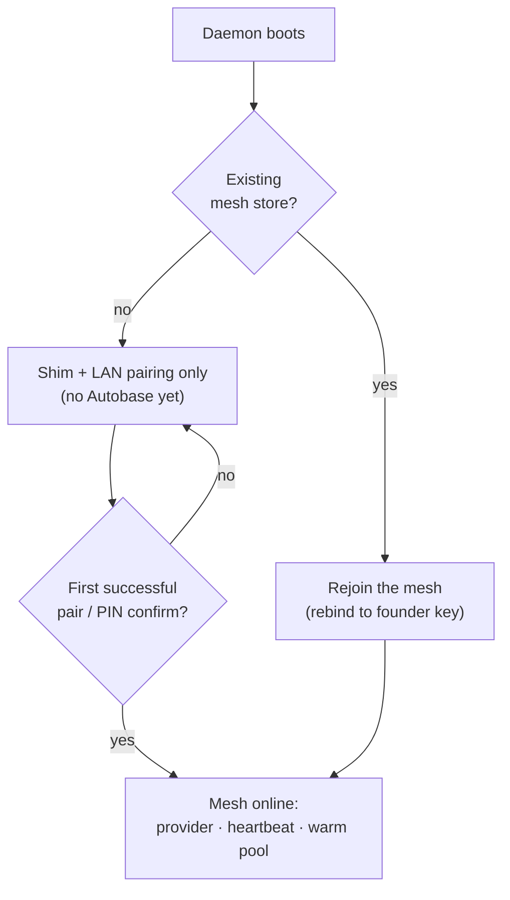

Hypha is the headless daemon that owns every mesh concern on a device. The web app stays
small and stateless; Hypha carries the long-lived state — pairing, peer health,
warm-model tracking, the forward path, and the delegated-compute control surface. It is
the process the [architecture](/explanation/architecture) page calls "Layer 1 — Mesh".

Every device runs the same daemon, and it is deliberately symmetric. The one process is
**both a provider and a consumer**: it serves paired peers (firewall-locked to their
gossiped consumer keys) and it borrows from peers, shedding local overflow onto a peer's
warm model through the localhost shim. Because the provider and consumer halves share the
device's `QVAC_HYPERSWARM_SEED`, this device's consumer key equals its provider key —
there is no separate identity to manage for each role.

## Why the mesh starts lazily

A fresh device has no one to serve and no one to gossip to. So Hypha does **not** open a
mesh at boot. It runs only the localhost shim and LAN pairing until the device actually
pairs. Founding a mesh store before there is a peer would create an empty Autobase whose
only purpose is to be merged later — and merging two already-populated Autobases is the
exact situation the lazy model exists to avoid.

The trigger is a successful pair. Pairing — whether through the CLI or the Services
"Add a device" flow, and confirmed by the LAN PIN — founds or joins a mesh, and only then
does the full mesh come online: the provider, the heartbeat, and the warm pool all start
on that first confirmed pair. A device that already has a mesh store rejoins it at boot
instead, rebinding to the founder's bootstrap key so it reattaches to the *same* graph
rather than forking a new one.

The forward client is the one piece constructed eagerly, because it is cheap — its swarm
is lazy and does no work until a borrow happens. Everything heavier waits for a real peer.

This is why polling the control endpoints on a mesh-less device stays harmless: reading
peer state never forces a mesh online. The mesh comes up on a pair, not on a query.

## The forward and metering path

The daemon's reason to exist on the request path is overflow. When a request arrives that
the local machine cannot serve — the alias is not held locally, or the local queue is too
deep — the broker sheds it to Hypha, which routes it to a mesh peer that holds the alias
warm and runs it on *that* peer's local serve. The companion page
[How the mesh routes work](/explanation/how-the-mesh-routes-work) covers the warm-peer
selection in detail.

A forwarded turn is also where billing belongs, because the routing decision and the
charge are the same event. When the chosen peer advertises a paid rail, the forward path
opens a metered session against that one peer, settles the borrowed compute, and records a
receipt — rather than pushing that logic into the UI. The free path (no paid rail, or
metering disabled) simply forwards with failover. The economics of that path are explained
in [The agent economy](/explanation/the-agent-economy); the operator steps live in the
[Economy](/platforms/economy) guide.

## The control endpoints

Hypha exposes a small localhost control surface that the dashboard reads. These are the
conceptual roles; the request/response shapes are in the reference pages, and the
how-to lives in [Mesh](/platforms/mesh) and [Economy](/platforms/economy).

- `GET /peers` returns the live peer picture — who is paired, who is live, which aliases
  each can serve — plus this device's own key and the derived mesh leader. It is read-only:
  polling it on a mesh-less device never forces a mesh online.
- `GET /mesh/list` enumerates this device's memberships (its primary mesh and any
  secondary meshes or public cells it has joined).
- `POST /mesh/invite` mints a blind invite for a mesh — the invite *is* the capability to
  join, so there is no bootstrap key to copy by hand.
- `POST /mesh/join` joins a mesh from an invite. The first mesh a device joins becomes its
  **primary**; later ones get their own namespace.
- `GET /reputation` returns the per-provider scores Hypha derives from settled receipts and
  local observations.

The membership model behind these — multiple meshes, who can write, and the CRDT that
keeps every device consistent — is explained in
[The mesh and membership](/explanation/mesh-and-membership).

## Why a daemon and not a request handler

Pairing, peer health, warm-model tracking, and delegated-compute control are long-lived
concerns that outlive any single browser request. They fit a daemon far better than a
request handler bound to a page load. Keeping them in Hypha lets the web app stay a thin
client of a process that already holds the mesh's state — and lets that state survive
restarts, because the mesh underneath it is a replicated CRDT, not in-memory session data.
