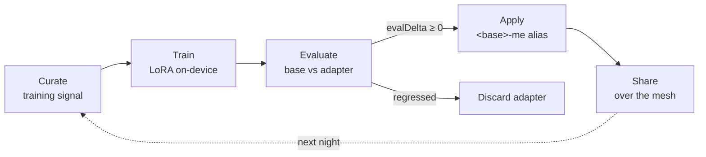

Most assistants are static between releases. Leash's fourth layer — "The Understory" — closes
a loop: each night it distills how you've been using the system into a small **LoRA adapter**,
checks that the adapter is actually better, and only then promotes it. This page explains why
the loop exists and how it stays safe. It builds on the broader
[memory, senses, and mind loop](/explanation/memory-senses-mind-loop); for what the published
paper looks like, see [What The Understory is](/explanation/what-the-understory-is).

## Why train at all

Retrieval and typed memory get you far: the assistant can look up your notes and recall saved
preferences. But retrieval doesn't change how the model *reasons* — it only changes what's in
the prompt. A LoRA adapter is how accepted outcomes become part of the model's behavior rather
than just its context. The constraint is the interesting part: the training has to happen
**on-device**, on consumer hardware, with no cloud GPUs — which is exactly what QVAC's
fine-tuning (Fabric) makes possible.

## The five stages

The loop runs as one nightly job (scheduled at 02:00 by the cron daemon):

1. **Curate** — gather the night's training signal from memories, feedback, and accepted
   interactions into a training set.
2. **Train** — run LoRA fine-tuning on a trainable base model, on-device.
3. **Evaluate** — score both the base model and the new adapter on frozen test axes, and
   compute the delta.
4. **Apply** — promote the adapter to a served alias **only if it didn't regress**
   (`evalDelta ≥ 0`). A worse adapter is discarded; the loop never ships a regression.
5. **Share** — publish the promoted adapter over the mesh so your other devices can pick it up.

The eval gate in stage 4 is the whole point: an unattended nightly trainer is only trustworthy
if it can refuse to ship its own bad output.

## The `<base>-me` alias

A promoted adapter doesn't overwrite the base model. It is served under a sibling alias formed
by suffixing the base name — so `qwen3-4b` gains a `qwen3-4b-me` alias that mirrors the base
config and adds the adapter. The base stays available unchanged; "me" is the personalized
variant you can route to or roll back from. The trainable base is configurable (it defaults to
a larger model than the chat model, since training quality benefits from more parameters) along
with the number of epochs.

## Why sharing is part of the loop

A personal adapter is only useful on the device that trained it unless it travels. The mesh
distributes adapters symmetrically and idempotently: a device **publishes** its newest
promotable adapter as chunks onto a shared Hypercore, and **fetches** any mesh adapter newer
than what's on local disk, reassembling and verifying it by SHA-256 before writing it. Because
it rides the same encrypted primary mesh as everything else, the adapter never touches a
third-party server — your personalization stays as private as the data it was trained on.

## The honesty cost

This is the most experimental layer, and the docs treat it that way. The spike proved the
primitive end-to-end (a real adapter, trained on-device, that measurably changed behavior — see
[Evidence & reproducibility](/hackathon/evidence-and-reproducibility)), but a trivial training
set won't memorize exact targets, and eval axes have to be chosen carefully or the gate is
meaningless. The loop's value is structural — curate, gate, promote, share — not a claim that
one night of your data produces a dramatically smarter model.
