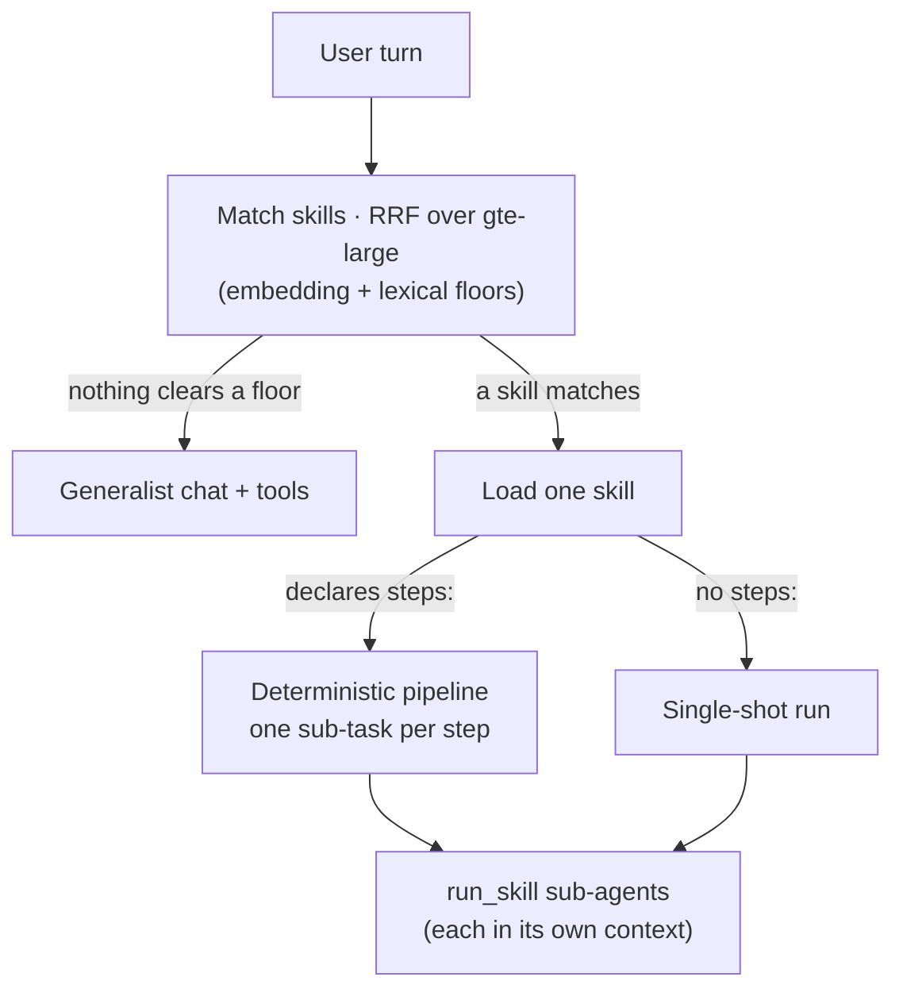

Leash runs on a 4-billion-parameter model. A model that small does not reliably plan,
remember a long tool sequence, and stay on task all at once. The skills harness is the answer:
instead of asking one model to do everything in one giant context, it routes to the right
**skill**, runs it as a focused sub-agent, and — when the work has dependent steps — drives
those steps deterministically. This page explains the design. For the steps, see
[Build multi-skill workflows](/capabilities/skills) and the
[Skills](/capabilities/skills) guide.

## Skills-first routing

A skill is a folder of instructions (the [agentskills.io](https://agentskills.io) layout) that
the assistant loads on demand. The harness decides which skill fits a turn by **semantic
matching**, not keyword lookup. Each skill declares a description and example utterances; those
are embedded with the already-loaded `gte-large` model, and the turn is matched by similarity.

Matching is deliberately conservative. An embedding floor (calibrated around 0.81) separates
true intents from near-misses, a lexical floor catches keyword-only hits, and the two rankings
are combined with **reciprocal rank fusion** (RRF). Only candidates that clear a floor are
fused, and the harness loads **one** skill at a time — keeping the model's context lean instead
of stuffing every skill's instructions into every turn.

## Sub-agent orchestration with `run_skill`

A skill can call another skill through `run_skill`. The sub-agent runs in its **own focused
context** with its own tool set and returns just its result to the caller. This is what makes
multi-skill workflows possible without context blowup: a coordinating skill stays small because
each sub-task's reasoning happens in a separate, disposable context rather than accumulating in
the main thread.

## Deterministic step pipelines

Free-running tool loops are where a 4B model drops steps — it forgets a dependency, or decides
it's "done" early. So a skill author can declare an ordered list of **steps**. When steps are
present, `run_skill` stops free-running and becomes a **deterministic pipeline**: the harness
drives the steps in order, the model does exactly one sub-task per step with prior results fed
forward, and the model never gets to decide whether it's finished. The planning burden moves to
the skill author, where it can be written once and verified, instead of being re-derived by a
small model every turn.

**Plan mode** applies the same idea to ad-hoc chat: the model drafts a plan, you approve it,
and the harness then drives the approved steps through the pipeline. It is available on plain
chat turns — image, file, computer-use, and skill-pipeline turns already have their own
workflows.

## Steering a running turn

Because turns can be long, the harness lets you **interject** — queue a follow-up while a turn
is busy. The running turn checks the queue at step boundaries and ends cleanly, then the queued
message runs as the next turn. This is steering, not interruption: the in-flight generation
completes server-side (a deliberate safety property) rather than being killed mid-stream.

## Staying within budget

Long conversations are kept inside the model's window by **compaction**: once history grows
past roughly 80% of the context budget, the oldest messages are summarized into a running
summary while a tail of recent messages stays verbatim. The full transcript stays visible to
you; only the model sees the compacted form. The context window itself is large by default
(32,768 tokens for the chat model), and tool exposure is capped per turn so the prompt never
overflows with schemas.

## The prompt-injection posture

Skills are third-party prompt input, and some carry executable scripts. The harness treats them
as untrusted by default: **imported skills land disabled**, script execution pauses on an
approval card every time, scripts run without a shell with a stripped environment and hard
time/output limits, and tools that change state sit behind approval. The boundary is explicit
so that adding a capability never silently grants it.
