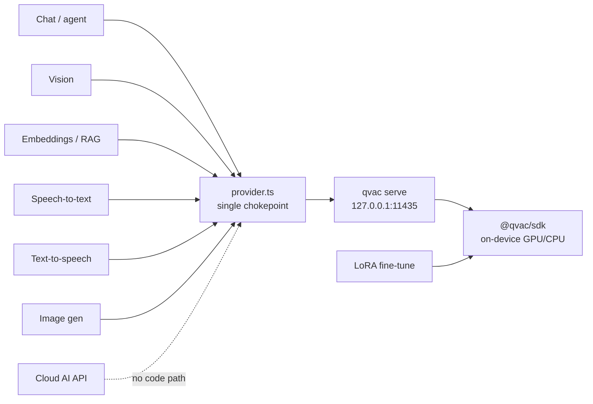

The hackathon's central rule is that **all** AI work — inference, embeddings, RAG, multimodal,
TTS/STT — runs on-device through the QVAC SDK, with cloud APIs allowed only for clearly
disclosed non-AI services. This page shows how Leash satisfies that by construction.

## One inference endpoint, hardcoded to localhost

Every AI call in the web app goes through `apps/web/lib/leash/provider.ts`, which targets a
**hardcoded local endpoint** — `http://127.0.0.1:11435/v1` — served by `qvac serve` via
`@qvac/ai-sdk-provider`. There is no code path that reaches an external LLM API; swapping in a
cloud key isn't a config toggle, it doesn't exist.

| Path | Alias | Backing model |
|---|---|---|
| Chat / agent | `qwen3-4b` | `QWEN3_4B_INST_Q4_K_M` |
| Embeddings / RAG / skill matching | `gte-large` | `GTE_LARGE_FP16` |
| Health route | `medpsy` | `MEDGEMMA_4B_IT_Q4_1` |
| Vision / screenshots | `qwen3vl` | `QWEN3VL_2B_MULTIMODAL_Q4_K` + projection model |
| Speech-to-text | `parakeet` | `PARAKEET_TDT_0_6B_V3_Q8_0` |
| Text-to-speech | `supertonic` | `TTS_EN_SUPERTONIC_Q8_0` |
| Image generation | image alias | Flux2-klein / SD |
| Fine-tuning | LoRA | on-device QVAC Fabric → `<base>-me` adapter |

Borrowed compute doesn't break the rule either: delegated and forwarded turns run on a **peer's**
QVAC serve over the encrypted mesh — still QVAC, still on a device you own.

<Note>
**P2P delegation is not a "multi-GPU cluster."** The rules prohibit leveraging multi-GPU inference
*clusters* for better performance, but explicitly encourage *"real-time applications that combine
local inference with P2P delegation"* and *"P2P load distribution"* as a General Purpose / Tinkerer
focus area. Leash's mesh is the latter: independent personal devices, each running its own single
QVAC serve, that pass whole completions to one another over an encrypted DHT — not a pooled
multi-GPU engine. Every device still satisfies its track's RAM constraint on its own.
</Note>

## The vision fork — still QVAC, upstreamed

Vision needed one fix. The stock `qvac serve` OpenAI-compatible endpoint rejected multimodal
content arrays, so images never reached the vision model. Leash carries a **patch-package** fork
of `@qvac/cli` (`mycelium/patches/@qvac+cli+0.7.0.patch`) that:

- accepts array content (`text` + `image_url` parts) on chat messages,
- decodes each base64 image to a temp file and attaches it via the native completion
  `attachments` contract (PNG/JPEG; unsupported formats degrade to text rather than aborting),
- adds a `kvCache` passthrough for delegated KV-cache reuse.

This extends QVAC's own serve — it does not route around it. The change is applied in-repo via
`patches/@qvac+cli+0.7.0.patch` and upstreamed as `tetherto/qvac#2459`.

## The only remote calls are non-AI

Leash makes **no** cloud AI calls. The only outbound network calls are optional, non-AI services,
each disclosed:

| Service | Purpose | AI? |
|---|---|---|
| DuckDuckGo HTML (or self-hosted SearXNG) | web search for deep research | No |
| GitHub codeload | downloading imported skill zips | No |
| HuggingFace / QVAC registry | first-run model weight downloads | No (weights, then offline) |

After the one-time warm-cache, the system runs in airplane mode. The **complete, code-derived
disclosure of every outbound call** — each one classified non-AI, and marked as first-run
warm-cache, opt-in feature, or localhost-only — is on the
[Remote network calls](/hackathon/network-disclosure) page.

## Why this holds by design

Three properties make the guarantee structural rather than aspirational:

1. **Single chokepoint** — all model access flows through one provider module pointed at
   localhost.
2. **Local weights** — models live in `~/.qvac`; the serve executes them on the device's GPU/CPU.
3. **Offline acceptance** — the project treats "works in airplane mode" as a release gate, which a
   hidden cloud dependency would fail.
